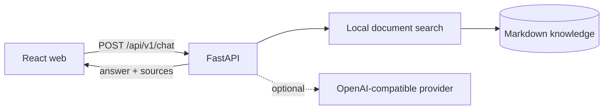

# Agent-Me Starter

[](https://github.com/jzjzzzzzzz/agent-me/actions/workflows/ci.yml)
[](LICENSE)
[](backend/pyproject.toml)

A clean, privacy-safe framework for publishing a question-answering agent grounded in documents you control. It includes a typed FastAPI service, a React interface, deterministic local retrieval, an optional OpenAI-compatible inference adapter, tests, containers, and security defaults.

> This repository is a reusable framework. It intentionally contains no production database, private memory, analytics records, credentials, or deployment secrets.

## What you get

- Markdown knowledge ingestion with source-level grounding
- Local extractive mode that works without an API key
- Optional OpenAI-compatible model provider
- Strict request schemas and configurable input limits
- Safe plain-text rendering in the browser
- Health and readiness endpoints
- Docker Compose, backend/frontend tests, linting, and CI

## Architecture



The API retrieves relevant excerpts first. With no provider configured, it returns the best grounded excerpt. With a provider configured, it sends only the retrieved context and recent conversation to that provider.

## Quick start

Requirements: Docker with Compose.

```bash
git clone https://github.com/jzjzzzzzzz/agent-me.git
cd agent-me
cp .env.example .env
docker compose up --build
```

Open <http://localhost:5173>. API documentation is available at <http://localhost:8000/docs>.

## Make it yours

1. Replace `knowledge/example-profile.md` with Markdown you have permission to publish.
2. Set `APP_NAME` and `APP_DESCRIPTION` in `.env`.
3. For generated answers, configure an OpenAI-compatible endpoint:

```dotenv
LLM_BASE_URL=https://provider.example/v1
LLM_API_KEY=replace-with-a-secret
LLM_MODEL=replace-with-a-model-id
```

4. Keep `.env` private. Use your platform's secret manager in production.
5. Review the returned sources and adjust your content before publishing.

## API

```bash
curl http://localhost:8000/api/v1/chat \
  -H 'Content-Type: application/json' \
  -d '{"question":"How does the example agent plan a project?"}'
```

Response:

```json
{
  "answer": "For project planning, the example agent starts with user goals...",
  "mode": "extractive",
  "sources": [
    {
      "title": "Example profile",
      "path": "example-profile.md",
      "excerpt": "For project planning...",
      "score": 0.5
    }
  ]
}
```

See [API reference](docs/API.md), [architecture](docs/ARCHITECTURE.md), and [deployment guide](docs/DEPLOYMENT.md).

## Local development

```bash
make setup
make lint
make test
make build
```

Or run services separately:

```bash
.venv/bin/uvicorn app.main:app --app-dir backend --reload
cd frontend && npm run dev
```

## Data and privacy

- Local extractive mode does not transmit questions or documents to a model provider.
- Provider mode transmits retrieved context, the question, and recent history to the endpoint you configure.
- This starter does not persist chat content or enable analytics by default.
- Do not publish secrets, credentials, private communications, health information, or other sensitive personal data as knowledge files.

## Related project

For an OpenAI-compatible endpoint whose answers are written by authorized people through a shared queue, see [Human API](https://github.com/jzjzzzzzzz/human-api).

## Contributing and security

Read [CONTRIBUTING.md](CONTRIBUTING.md) before opening a pull request. Report vulnerabilities privately through [GitHub Security Advisories](SECURITY.md), not public issues.

## License

[MIT](LICENSE)
