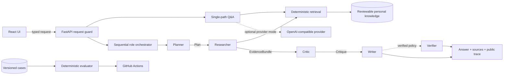

<div align="center">

# Agent-Me

### Distill yourself into an AI Agent Twin.

Feed it your knowledge, memories, projects, preferences, experiences, and decisions. Agent-Me turns them into an AI Agent Twin that keeps learning how you think and work.

It is not just a chatbot that knows facts about you. It is an open-source, inspectable architecture for building a second digital version of you—one that can retrieve, reason, verify, and eventually act with your context.

**An AI agent that is learning to become me.**

[Live example: John Zhou's AI Twin](https://jz-ai-chat.com) · [Quick start](#quick-start) · [Roadmap](ROADMAP.md) · [Architecture](docs/ARCHITECTURE.md) · [Learn](LEARN.md) · [Contribute](CONTRIBUTING.md)

<p>
  <a href="https://github.com/jzjzzzzzzz/agent-me/actions/workflows/ci.yml"></a>
  <a href="https://github.com/jzjzzzzzzz/agent-me/releases"></a>
  
  
  <a href="LICENSE"></a>
</p>

[English](README.md) · [简体中文](docs/i18n/README.zh-CN.md) · [All languages](docs/LOCALIZATION.md)

</div>


## What is Agent-Me?

A conventional chatbot starts over with a prompt and returns an answer:

```text
user → prompt → model → answer
```

Agent-Me treats a personal AI as a system:

```text
your knowledge
      ↓
reviewable memory → retrieval → planning → evidence → critique → verification → response
```

The aim is not merely to answer questions *about* a person. It is to build an increasingly useful AI representation of:

- what I know;
- what I have done;
- what I prefer;
- how I make decisions;
- what evidence supports those beliefs; and
- how certain the system should be about them.

Today, the repository provides a runnable FastAPI + React implementation over reviewable Markdown knowledge, with deterministic retrieval and sequential agent roles. That working system is the foundation behind [John Zhou's AI Twin](https://jz-ai-chat.com), not just a conceptual framework.

## Why an AI Twin?

Many personal chatbots are effectively a prompt, a vector database, and a chat interface. They can recall biographical facts or imitate a writing style, but that is not the same as reliably representing a person.

> Remembering facts about a person is easy.<br>
> Building a system that can reliably represent that person is much harder.

The deeper question behind Agent-Me is: **what would it take for an AI to actually represent a person?** Such a system needs more than recall. It needs durable identity and memory models, provenance, temporal updates, uncertainty, reasoning, verification, and user control.

Agent-Me does not claim to solve all of those problems today. It provides a concrete, testable architecture for exploring them without hiding the process behind a single model response.

## Why Agent-Me is different

### Reviewable identity and memory

The current memory substrate is version-controlled Markdown: small, explicit, and inspectable. It gives the twin a stable body of personal knowledge instead of treating every conversation as isolated. Persistent conversational memory, temporal updates, and richer structured identity models remain future work.

### Evidence-grounded responses

Retrieved personal knowledge remains connected to exact source excerpts. The system can refuse synthesis when it has insufficient evidence rather than filling gaps with confident invention.

### Multi-agent reasoning

Planner, Researcher, Critic, Writer, and optional Verifier roles have separate responsibilities and communicate through typed Python contracts. The goal is not to maximize the number of agents; it is to make important decisions explicit and testable.

### Inspectable execution

Agent-Me exposes a public execution trace: role outcomes, safe intermediate summaries, evidence, metrics, retrieval activity, and verification results. It does **not** expose or claim to expose a model's private chain-of-thought.

### Verification and evaluation

Before an answer is returned, implemented checks can validate citation paths, evidence policy, and output invariants. Versioned cases then test supported, unsupported, adversarial, and boundary requests deterministically.

> Most AI assistants show you only:
>
> `prompt → answer`
>
> Agent-Me exposes the system in between:
>
> `memory → retrieval → planning → evidence → critique → verification → answer`

**Because if an AI is going to represent you, you should be able to inspect why it speaks for you.**

## How it works

| Part | Role in the AI Twin | Current implementation |
| --- | --- | --- |
| Personal knowledge | Represents what the twin knows | Reviewable, version-controlled Markdown |
| RAG | Finds relevant personal evidence before answering | Bounded deterministic local retriever |
| Planner | Decides how to approach a question | Typed plan artifact |
| Researcher | Collects evidence for the plan | Exact source excerpts and metadata |
| Critic | Challenges unsupported synthesis | Evidence-sufficiency gate |
| Writer | Produces the grounded response | Citation-aware answer artifact |
| Verifier | Prevents invalid output from passing | Optional citation-path and metadata checks |
| Public trace | Makes execution inspectable | Safe stage summaries, outcomes, and metrics |
| Evaluation | Measures behavior beyond a demo | Versioned fixtures and deterministic runner |

Knowledge graphs, richer structured memory, typed intent routing, and broader tool calling are natural extensions of this model, but are not presented here as finished capabilities.

## Architecture

**Agent-Me treats an AI Twin as a system, not a prompt.**



The baseline policy executes Planner → Researcher → Critic → Writer. The verified policy adds Verifier as a fifth stage. Frozen dataclasses define the `Plan`, `EvidenceBundle`, `Critique`, `WrittenAnswer`, and `Verification` handoffs. Both policies run sequentially in one process against the same bounded retriever.

> [!NOTE]
> The Verifier checks citation paths and other implemented output invariants. It does not prove factual truth or semantic entailment. See [Trust, Data Flow, and Deployment Boundaries](docs/TRUST.md) for the complete system boundary.

Read [System Architecture](docs/ARCHITECTURE.md) for request paths and contracts, and [API Reference](docs/API.md) for endpoint schemas.

## Inspect a run

Run the five-stage verified workflow:

```bash
curl http://localhost:8000/api/v1/collaborate \
  -H 'Content-Type: application/json' \
  -d '{"question":"How does the example agent plan a project?","workflow":"verified"}'
```

| Field | What it lets you inspect |
| --- | --- |
| `workflow` | Selected four- or five-stage policy |
| `sources` | Exact excerpts available to the roles |
| `grounded` | Whether the implemented evidence policy passed |
| `trace` | Role, outcome, safe summary, and metrics for each stage |
| `run_id` | Server-generated execution identity |

When evidence is missing, the Critic blocks synthesis and the Writer returns a fixed insufficient-evidence response. In verified mode, invalid citation paths or citation-count metadata are blocked as well.

## Evaluation

The checked-in fixtures cover supported, unsupported, adversarial, and boundary requests. Results are deterministic for the same code, corpus, workflow, and input.

```bash
make test
make evaluate
.venv/bin/python scripts/evaluate_collaboration.py --workflow verified --json
```

The default evaluator reports `COLLABORATION_EVAL 4/4 passed`. CI also runs backend tests, frontend lint/typecheck/tests/build, documentation validation, both workflow policies, and container smoke tests. See [Lesson 06](course/06-evaluation/README.md) and the [evaluation fixtures](course/fixtures/collaboration_cases.json).

## Quick start

### Docker Compose

**Requirement:** Docker with the Compose plugin.

```bash
git clone https://github.com/jzjzzzzzzz/agent-me.git
cd agent-me
cp .env.example .env
docker compose up --build
```

| Service | URL |
| --- | --- |
| Web application | <http://localhost:5173> |
| Interactive API docs | <http://localhost:8000/docs> |
| Health | <http://localhost:8000/health> |
| Readiness | <http://localhost:8000/ready> |

The default configuration uses local extractive and collaboration modes, so no API key is required. The web container reaches the API through a same-origin `/api` gateway.

<details>
<summary><strong>Run with the local toolchain</strong></summary>

**Requirements:** Python 3.11+, `uv` 0.11 or 0.12, Node.js 22+, npm, and Git.

```bash
git clone https://github.com/jzjzzzzzzz/agent-me.git
cd agent-me
make setup
make lint test docs evaluate
```

Start the services in separate terminals:

```bash
.venv/bin/uvicorn app.main:app --app-dir backend --reload
```

```bash
cd frontend && npm run dev
```

See [Lesson 00](course/00-course-setup/README.md) for platform-specific setup and troubleshooting.

</details>

## Build your own AI Twin

1. Replace [`knowledge/example-profile.md`](knowledge/example-profile.md) with reviewed Markdown you are allowed to use.
2. Configure `APP_NAME` and `APP_DESCRIPTION` in your private `.env`.
3. Add supported, unsupported, adversarial, and boundary evaluation cases.
4. Extend typed artifacts and update the Python and TypeScript contracts together.
5. Configure an OpenAI-compatible provider only when its data-processing boundary is acceptable.

Key implementation entry points:

```text
backend/app/collaboration.py        role contracts and orchestration
backend/app/knowledge.py            bounded deterministic retrieval
backend/app/main.py                 FastAPI routes and public metadata
frontend/src/                       React client and strict response parsing
course/fixtures/                    versioned behavioral cases
scripts/evaluate_collaboration.py   deterministic evaluator
```

## Learn by rebuilding Agent-Me

The repository also includes a bilingual engineering curriculum that walks through the architecture from retrieval and evidence to multi-agent orchestration and verification. It is an educational layer around the working system, not the definition of Agent-Me itself.

Start with the [English syllabus](course/README.md), [简体中文课程](course/translations/zh-CN/README.md), [learning path](LEARN.md), [rubric](course/RUBRIC.md), or [glossary](course/GLOSSARY.md).

## What Agent-Me is not

Agent-Me is not:

- a prompt pretending to be you;
- a character chatbot or voice clone;
- a static vector database;
- a black-box autonomous agent; or
- a general-purpose multi-agent framework.

It is an experimental architecture for building a persistent, inspectable AI representation of a person. The current implementation is an early, deliberately bounded step toward that goal.

## Roadmap: toward a continuously learning AI Twin

Today, Agent-Me can retrieve and reason over reviewable personal knowledge. The longer-term goal is an AI Twin that can continuously learn from a person's:

- knowledge and projects;
- conversations and decisions;
- preferences and experiences; and
- relationships between people, events, and ideas;

while preserving provenance, uncertainty, privacy, inspectability, and user control.

The roadmap develops that goal in explicit, reviewable layers:

1. **Inspectable foundation — current:** personal knowledge retrieval, typed agent roles, evidence gates, public traces, and deterministic evaluation.
2. **Structured identity and memory:** typed records for people, projects, preferences, decisions, events, and their sources.
3. **Continuous learning:** consent-based ingestion, deduplication, temporal updates, conflict handling, confidence, and forgetting.
4. **Contextual agency:** typed intent routing, bounded tool use, and actions that remain attributable and reviewable.
5. **Longitudinal evaluation:** measure whether the twin stays faithful, current, useful, private, and under its owner's control over time.

See the full [AI Twin roadmap](ROADMAP.md), including current boundaries, design principles, proposed workstreams, and contribution opportunities.

**The goal is not to create a chatbot that sounds like you.**

**The goal is to explore what it takes to build a digital representation that can increasingly think with your context.**

## Security and trust

Local extractive and collaboration modes do not call an external model provider. Optional provider mode sends the question, recent history, and retrieved context to the configured OpenAI-compatible endpoint. The current implementation does not persist chats or include application telemetry.

Read [Trust, Data Flow, and Deployment Boundaries](docs/TRUST.md) before adding private knowledge or an external provider. Report vulnerabilities through the private process in [SECURITY.md](SECURITY.md), not a public issue.

## Documentation

| Guide | Covers |
| --- | --- |
| [AI Twin roadmap](ROADMAP.md) | Continuous learning, structured memory, tools, evaluation, and owner control |
| [Architecture](docs/ARCHITECTURE.md) | Components, contracts, request paths, and limitations |
| [API reference](docs/API.md) | Endpoints, schemas, examples, and error behavior |
| [Trust model](docs/TRUST.md) | Local/provider data flow, persistence, verification, and deployment boundaries |
| [Deployment](docs/DEPLOYMENT.md) | Container behavior and production hardening gaps |
| [Localization](docs/LOCALIZATION.md) | UI locales, translated overviews, and contribution rules |
| [Course design](docs/COURSE_DESIGN.md) | Educational structure and learning outcomes |

## Contributing

Agent-Me welcomes contributions toward a trustworthy, continuously learning AI Twin—not only code. Useful contributions include memory schemas, provenance and temporal models, ingestion boundaries, privacy controls, evaluation cases, agent contracts, documentation, security reviews, and focused improvements to the current implementation.

Start with the [roadmap](ROADMAP.md), then read [CONTRIBUTING.md](CONTRIBUTING.md). For substantial roadmap work, open a feature proposal before implementation so the problem, boundaries, and evaluation plan can be discussed first.

## License

Agent-Me is available under the [MIT License](LICENSE).

## Acknowledgements

Special thanks to [BizBot](https://bizbot.zvo.cn/), developed by Weifang Leimingyun Network Technology Co., Ltd., for providing automated outreach and promotion support for Agent-Me.
