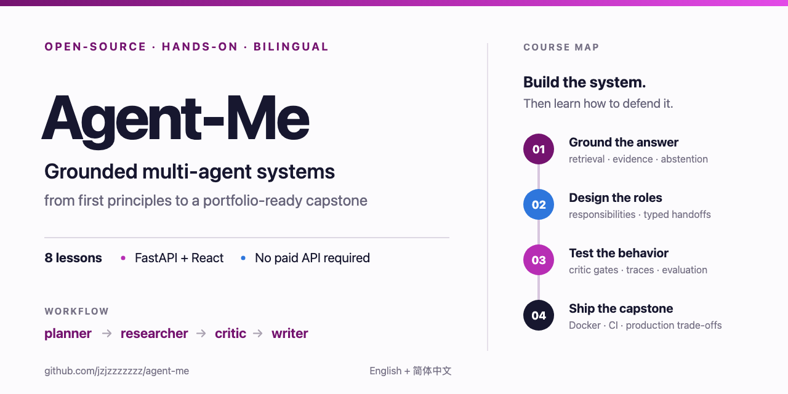
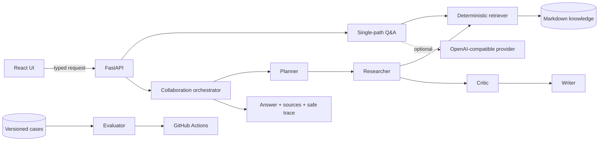

<div align="center">



# Agent-Me: Grounded Multi-Agent Systems from First Principles

**A free, hands-on course for building, testing, and explaining an auditable AI-agent system.**

Learn the theory, run the application, inspect every handoff, break it deliberately, and finish
with a portfolio-ready capstone. No paid model API is required for the core course.

[Start the course](LEARN.md) · [5-minute setup](course/00-course-setup/README.md) · [Ask a question](https://github.com/jzjzzzzzzz/agent-me/discussions/categories/q-a) · [Contribute](CONTRIBUTING.md)

[English](README.md) · [简体中文](docs/i18n/README.zh-CN.md) · [繁體中文](docs/i18n/README.zh-TW.md) · [日本語](docs/i18n/README.ja.md) · [한국어](docs/i18n/README.ko.md) · [Español](docs/i18n/README.es.md) · [Français](docs/i18n/README.fr.md) · [Deutsch](docs/i18n/README.de.md) · [Português](docs/i18n/README.pt-BR.md)

[](https://github.com/jzjzzzzzzz/agent-me/actions/workflows/ci.yml)
[](course/README.md)
[](course/LANGUAGES.md)
[](LICENSE)
[](backend/pyproject.toml)
[](frontend/package.json)

</div>

---

## Choose your path

| I want to… | Start here | Suggested time |
| --- | --- | ---: |
| Understand grounded agents from zero | [Lesson 00: Setup](course/00-course-setup/README.md) | 6–9 hours total |
| Study the multi-agent implementation | [Lesson 03: Role design](course/03-role-design/README.md) | 3–4 hours |
| Build a resume-ready extension | [Lesson 07: Capstone](course/07-production-capstone/README.md) | 1–3 days |
| Deploy the reusable application | [Deployment guide](docs/DEPLOYMENT.md) | 30–60 minutes |
| Improve the course or translate it | [Contributing guide](CONTRIBUTING.md) | Start with one issue |

> **New to agent systems?** Follow lessons 00–07 in order. Each lesson contains concepts, a
> guided lab, verification commands, exercises, interview questions, and a completion checklist.

## What you will build

You will evolve a small grounded Q&A service into a four-role collaboration workflow:

```text
question
   │
   ▼
planner ──Plan──▶ researcher ──EvidenceBundle──▶ critic ──Critique──▶ writer
                       │                            │                     │
                       ▼                            └── block             ▼
                Markdown knowledge                           answer + sources + trace
```

The repository is both **course material** and the **working reference implementation**. You do
not study pseudocode and then discover that the real project is different: every lesson points to
tested source files in this repository.

By completing the course, you will be able to:

- explain retrieval-grounded generation and its failure modes;
- decide when role decomposition helps—and when one function is better;
- design immutable, typed handoffs between planner, researcher, critic, and writer roles;
- expose operational traces without exposing hidden chain-of-thought;
- build deterministic behavioral evaluations for grounded and unsupported questions;
- validate the same API contract in Python and TypeScript;
- reason about retries, idempotency, queues, backpressure, privacy, and tenant isolation;
- present a measured, technically accurate project in a portfolio or interview.

## Course curriculum

| # | Lesson | Core idea | Hands-on result | Time |
| ---: | --- | --- | --- | ---: |
| 00 | [Environment and learning loop](course/00-course-setup/README.md) | Reproducibility before experimentation | A tested local baseline | 30–45 min |
| 01 | [Grounded Q&A foundations](course/01-grounded-qa/README.md) | Retrieval and generation are separate decisions | Compare extractive and provider modes | 45–60 min |
| 02 | [Build the retrieval pipeline](course/02-retrieval/README.md) | Chunking, ranking, evidence, and abstention | Inspect and test deterministic retrieval | 60–75 min |
| 03 | [Design collaborating roles](course/03-role-design/README.md) | Decompose by responsibility, not by fashionable labels | Compare single-path and four-role flows | 45–60 min |
| 04 | [Typed handoffs and orchestration](course/04-typed-orchestration/README.md) | Contracts make coordination inspectable | Trace and extend immutable artifacts | 60–90 min |
| 05 | [Critic gates and safe observability](course/05-critic-observability/README.md) | A trace is not chain-of-thought | Observe approved and blocked browser paths | 45–60 min |
| 06 | [Evaluation, tests, and failure injection](course/06-evaluation/README.md) | Replace demo confidence with repeatable evidence | Add cases and make CI catch a failure | 60–90 min |
| 07 | [Production design and capstone](course/07-production-capstone/README.md) | Local correctness is not distributed reliability | Design and implement a portfolio extension | 90+ min |

Full syllabus, learning outcomes, rubric, and glossary: **[open the course](course/README.md)**.

## How the course teaches

Every lesson follows the same learning contract:

1. **Why it matters** — the engineering problem, not only the API.
2. **Mental model** — precise terminology and system boundaries.
3. **Read the implementation** — a small, ordered source-code tour.
4. **Run the lab** — commands against the real application.
5. **Observe evidence** — response fields, tests, traces, or metrics.
6. **Change one thing** — a required exercise and optional challenges.
7. **Verify** — deterministic commands and a completion checklist.
8. **Explain** — interview questions that test understanding rather than memorization.

This structure is inspired by established open course repositories that use numbered lessons,
explicit prerequisites, runnable samples, exercises, and contribution paths. See
[Course design](docs/COURSE_DESIGN.md) for the pedagogical decisions and source references.

## Architecture you will study



The default collaboration workflow is deterministic, sequential, and runs in one process. It is
accurately described as **role-based multi-agent orchestration**. It does not claim to use four
models, four autonomous processes, or a distributed worker platform. Lesson 07 explains what
those stronger claims would require.

## Run the project

### Option A — Docker Compose

**Prerequisite:** Docker with the Compose plugin.

```bash
git clone https://github.com/jzjzzzzzzz/agent-me.git
cd agent-me
cp .env.example .env
docker compose up --build
```

Open:

- Web application: <http://localhost:5173>
- Interactive API docs: <http://localhost:8000/docs>
- Health: <http://localhost:8000/health>
- Readiness: <http://localhost:8000/ready>

Local extractive and multi-agent lab modes require no API key.

### Option B — Local toolchain

**Prerequisites:** Python 3.11+, [uv](https://docs.astral.sh/uv/getting-started/installation/)
0.11 or 0.12, Node.js 20+, npm, and Git.

```bash
git clone https://github.com/jzjzzzzzzz/agent-me.git
cd agent-me
make setup
make lint
make test
make docs
make evaluate
```

Start the services in separate terminals:

```bash
.venv/bin/uvicorn app.main:app --app-dir backend --reload
```

```bash
cd frontend
npm run dev
```

Expected deterministic evaluation summary:

```text
COLLABORATION_EVAL 4/4 passed
```

If setup differs on your platform, use the troubleshooting section in
[Lesson 00](course/00-course-setup/README.md).

## A first experiment

Call the collaboration endpoint:

```bash
curl http://localhost:8000/api/v1/collaborate \
  -H 'Content-Type: application/json' \
  -d '{"question":"How does the example agent plan a project?"}'
```

Inspect these fields rather than judging only the prose answer:

- `run_id`: server-generated execution identity;
- `grounded`: whether the critic found retrieved evidence;
- `sources`: the exact excerpts available to the workflow;
- `trace`: planner → researcher → critic → writer operational stages.

Then ask an unsupported question and compare the critic and writer stages:

```bash
curl http://localhost:8000/api/v1/collaborate \
  -H 'Content-Type: application/json' \
  -d '{"question":"Explain quantum chromodynamics renormalization."}'
```

The workflow should abstain because that evidence does not exist in the example knowledge base.
Lesson 05 explains why abstention is part of the product behavior, not an error to hide.

## Repository map

```text
agent-me/
├── course/                         English syllabus and 8 numbered lessons
│   ├── 00-course-setup/
│   ├── ...
│   ├── 07-production-capstone/
│   ├── fixtures/                   Versioned behavioral evaluation cases
│   └── translations/zh-CN/         Complete Simplified Chinese course
├── backend/                        FastAPI app, retriever, orchestrator, tests
│   └── uv.lock                     Locked direct and transitive Python dependencies
├── frontend/                       React app, strict response parser, UI tests
├── knowledge/                      Reviewable Markdown corpus
├── scripts/                        Evaluation and documentation checks
├── docs/                           API, architecture, deployment, course design
├── .github/                        CI and contribution templates
├── docker-compose.yml              Local production-shaped stack
└── .env.example                    Safe configuration template
```

## Languages

- The **complete course** is maintained in English and 简体中文.
- The project overview and web interface are available in 9 languages.
- English is the canonical technical source when a translation temporarily lags.
- Translation contributions are welcome; the repository never claims machine-generated text has
  been reviewed when it has not.

See [course language coverage](course/LANGUAGES.md) and the
[translation workflow](CONTRIBUTING.md#translate-the-course).

## Build your own agent

1. Complete Lessons 00–02 before replacing the example corpus.
2. Replace `knowledge/example-profile.md` with Markdown you have permission to use.
3. Set `APP_NAME` and `APP_DESCRIPTION` in `.env`.
4. Keep the local modes, or configure an OpenAI-compatible provider:

```dotenv
LLM_BASE_URL=https://provider.example/v1
LLM_API_KEY=replace-with-a-secret
LLM_MODEL=replace-with-a-model-id
```

5. Add evaluation cases that represent your own supported and unsupported questions.
6. Run the complete quality gate before publishing.

Provider mode sends retrieved context, the question, and recent history to the provider you choose.
Keep `.env` private and review that provider's data-processing terms.

## Contributing

Learners and experienced engineers are equally welcome. Useful contributions include:

- fixing a confusing explanation or typo;
- adding a reproducible exercise or evaluation case;
- improving accessibility or a translation;
- reporting a bug with a minimal reproduction;
- improving tests, security boundaries, or documentation.

Start with [CONTRIBUTING.md](CONTRIBUTING.md). It defines the issue workflow, lesson template,
translation rules, local checks, pull-request checklist, and privacy requirements. By
contributing, you agree that your contribution is licensed under the MIT License and that you
follow the [Code of Conduct](CODE_OF_CONDUCT.md).

- Ask course and setup questions in [GitHub Discussions Q&A](https://github.com/jzjzzzzzzz/agent-me/discussions/categories/q-a).
- Share a finished lab or capstone in [Show and tell](https://github.com/jzjzzzzzzz/agent-me/discussions/categories/show-and-tell).
- Choose a scoped task from [good first issues](https://github.com/jzjzzzzzzz/agent-me/issues?q=is%3Aissue%20state%3Aopen%20label%3A%22good%20first%20issue%22).

Security vulnerabilities must be reported privately as described in [SECURITY.md](SECURITY.md).

## Reference documentation

- [Complete course syllabus](course/README.md)
- [Step-by-step learning path](LEARN.md)
- [Simplified Chinese course / 简体中文课程](course/translations/zh-CN/README.md)
- [Course glossary](course/GLOSSARY.md)
- [Assessment and capstone rubric](course/RUBRIC.md)
- [API reference](docs/API.md)
- [System architecture](docs/ARCHITECTURE.md)
- [Deployment guide](docs/DEPLOYMENT.md)
- [Localization guide](docs/LOCALIZATION.md)
- [Course design](docs/COURSE_DESIGN.md)
- [Security policy](SECURITY.md)

## Privacy and scope

This public repository contains reusable code and course material only. It does not contain a
production database, private memory, analytics records, credentials, or deployment secrets.

- The browser renders returned content as text, not raw HTML.
- Request schemas, semantic limits, and an HTTP body-size limit are enforced server-side.
- Local extractive and collaboration modes do not call a model provider.
- Chat content and analytics are not persisted by this starter.
- Never publish credentials, private communications, regulated data, or personal records as
  knowledge files or evaluation fixtures.

## Related project

For an OpenAI-compatible endpoint whose answers are written by authorized people through a shared
queue, see [Human API](https://github.com/jzjzzzzzzz/human-api).

## License

Code and course material are available under the [MIT License](LICENSE).
