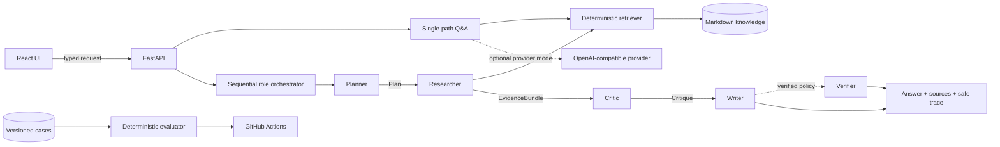

<div align="center">

# Agent-Me

**Build, inspect, and evaluate auditable multi-agent RAG systems.**

Agent-Me is an open-source reference implementation for auditable multi-agent RAG systems, paired
with a bilingual hands-on engineering curriculum.

It demonstrates typed handoffs, retrieval, evidence tracking, critique, verification, and
deterministic evaluation without hiding the system behind a black-box abstraction.

- Auditable Planner → Researcher → Critic → Writer workflow with an optional Verifier stage
- Local RAG over a reviewable Markdown knowledge base
- Typed handoffs, evidence-aware answers, safe traces, and deterministic evaluation
- Runnable FastAPI + React stack with a reproducible Docker setup
- English / 中文 engineering curriculum
- No paid model API required for the core local learning path

[Run the reference implementation](#quick-start) · [Explore the architecture](docs/ARCHITECTURE.md) · [Start the curriculum](LEARN.md) · [Read the trust model](docs/TRUST.md)

[English](README.md) · [简体中文](docs/i18n/README.zh-CN.md) · [繁體中文](docs/i18n/README.zh-TW.md) · [日本語](docs/i18n/README.ja.md) · [한국어](docs/i18n/README.ko.md) · [Español](docs/i18n/README.es.md) · [Français](docs/i18n/README.fr.md) · [Deutsch](docs/i18n/README.de.md) · [Português](docs/i18n/README.pt-BR.md)

[](https://github.com/jzjzzzzzzz/agent-me/actions/workflows/ci.yml)
[](https://github.com/jzjzzzzzzz/agent-me/releases)
[](course/README.md)
[](course/LANGUAGES.md)
[](LICENSE)

</div>


## What Agent-Me Is

Agent-Me is designed to make agent systems inspectable. It is:

1. a runnable open-source reference implementation of a role-based multi-agent RAG workflow;
2. a teaching system for inspecting role boundaries, retrieval, evidence, policy gates, and output;
3. a bilingual engineering curriculum that rebuilds the same architecture step by step; and
4. a starting point developers can extend with their own knowledge, policies, and evaluations.

Instead of presenting a final answer as a black box, the implementation exposes retrieved evidence,
typed intermediate artifacts, blocking decisions, safe operational traces, and verification results.

## What Agent-Me Is Not

Agent-Me is not currently:

- a distributed multi-agent runtime or a general-purpose agent SDK;
- a hosted enterprise platform;
- a guarantee of factual correctness; or
- a replacement for production authentication, tenancy, queueing, observability, rate limiting,
  or abuse prevention.

The “agents” are role-based stages with explicit contracts and sequential, in-process orchestration.
The verifier checks mechanical output invariants; it does not prove truth or entailment.

## Why Agent-Me

Many agent examples expose only:

```text
prompt → model → answer
```

Agent-Me exposes the path between request and output:

```text
request → planning → retrieval → evidence → critique → writing → verification → final answer
```

That makes the system useful for studying **inspectability**, **explicit role contracts**,
**evidence flow**, **reproducibility**, and **evaluation**—including what happens when evidence is
missing or an output invariant fails.

## Architecture



The baseline collaboration policy runs Planner, Researcher, Critic, and Writer. The verified policy
adds Verifier as a fifth stage. Frozen Python dataclasses define the `Plan`, `EvidenceBundle`,
`Critique`, `WrittenAnswer`, and `Verification` handoffs. Both policies run sequentially in one
process and use the same bounded local retriever.

Read [System Architecture](docs/ARCHITECTURE.md) for contracts, request paths, and limitations, and
[API Reference](docs/API.md) for endpoint schemas.

## Quick Start

### Docker Compose

**Prerequisite:** Docker with the Compose plugin.

```bash
git clone https://github.com/jzjzzzzzzz/agent-me.git
cd agent-me
cp .env.example .env
docker compose up --build
```

Open:

- Web application: <http://localhost:5173>
- Interactive API docs: <http://localhost:8000/docs>
- Health: <http://localhost:8000/health>
- Readiness: <http://localhost:8000/ready>

Local extractive and collaboration modes need no API key. The Compose web service uses a
same-origin `/api` gateway by default.

### Local toolchain

**Prerequisites:** Python 3.11+, `uv` 0.11 or 0.12, Node.js 22+, npm, and Git.

```bash
git clone https://github.com/jzjzzzzzzz/agent-me.git
cd agent-me
make setup
make lint test docs evaluate
```

Start the API and web app in separate terminals:

```bash
.venv/bin/uvicorn app.main:app --app-dir backend --reload
```

```bash
cd frontend && npm run dev
```

See [Lesson 00](course/00-course-setup/README.md) for platform-specific setup and troubleshooting.

## Example Workflow

Run the verified workflow:

```bash
curl http://localhost:8000/api/v1/collaborate \
  -H 'Content-Type: application/json' \
  -d '{"question":"How does the example agent plan a project?","workflow":"verified"}'
```

Inspect the response instead of judging only the prose:

- `workflow` identifies the selected four- or five-stage policy;
- `sources` contains the exact excerpts made available to the roles;
- `grounded` reports whether evidence passed the implemented policy;
- `trace` records role, outcome, safe summary, and metrics for each stage; and
- `run_id` provides a server-generated execution identity.

Now ask a question unsupported by the example corpus. The critic should block synthesis and the
writer should return the fixed insufficient-evidence response. In verified mode, the verifier also
blocks answers with invalid citation paths or citation-count metadata.

## Evaluation

The checked-in fixtures cover supported and unsupported requests. Evaluation is deterministic for
the same code, corpus, workflow, and input:

```bash
make test
make evaluate
.venv/bin/python scripts/evaluate_collaboration.py --workflow verified --json
```

The default evaluator should report `COLLABORATION_EVAL 4/4 passed`. CI also runs backend tests,
frontend lint/typecheck/tests/build, documentation checks, both evaluation policies, and container
smoke tests. See [Lesson 06](course/06-evaluation/README.md) and the
[evaluation fixtures](course/fixtures/collaboration_cases.json).

## Engineering Curriculum

The curriculum explains and rebuilds the same architecture used by the reference implementation.

**Reference implementation:** use it, inspect it, and extend it.

**Curriculum:** rebuild the architecture step by step and understand why each component exists.

| # | Lesson | Engineering focus | Hands-on result |
| ---: | --- | --- | --- |
| 00 | [Environment and learning loop](course/00-course-setup/README.md) | Reproducibility | Tested local baseline |
| 01 | [Grounded Q&A foundations](course/01-grounded-qa/README.md) | Retrieval vs. generation | Compare local/provider paths |
| 02 | [Build the retrieval pipeline](course/02-retrieval/README.md) | Chunking, ranking, evidence | Retrieval regression test |
| 03 | [Design collaborating roles](course/03-role-design/README.md) | Responsibility boundaries | Single vs. role workflow comparison |
| 04 | [Typed handoffs and orchestration](course/04-typed-orchestration/README.md) | Contracts and invariants | Tested handoff extension |
| 05 | [Critic gates and safe observability](course/05-critic-observability/README.md) | Blocking and trace safety | Approved/blocked path evidence |
| 06 | [Evaluation and failure injection](course/06-evaluation/README.md) | Repeatable behavioral evidence | New cases and caught failure |
| 07 | [Production design and capstone](course/07-production-capstone/README.md) | Missing production boundaries | ADR and measured extension |

Open the [English syllabus](course/README.md), [简体中文课程](course/translations/zh-CN/README.md),
[learning path](LEARN.md), [rubric](course/RUBRIC.md), and [glossary](course/GLOSSARY.md).

## Security & Trust Boundaries

Local extractive and collaboration modes do not call an external model provider. Optional provider
mode sends the question, recent history, and retrieved context to the configured OpenAI-compatible
endpoint. The reference implementation does not persist chats or include application telemetry.

Read [Trust, Data Flow, and Deployment Boundaries](docs/TRUST.md) before adding private knowledge or
an external provider. Vulnerabilities should be reported through the private process in
[SECURITY.md](SECURITY.md), not a public issue.

## Extending Agent-Me

1. Replace `knowledge/example-profile.md` with reviewed Markdown you are allowed to use.
2. Configure `APP_NAME` and `APP_DESCRIPTION` in your private `.env`.
3. Add supported, unsupported, adversarial, and boundary evaluation cases.
4. Extend typed artifacts and update both Python and TypeScript contracts together.
5. Configure an OpenAI-compatible provider only if you accept its data-processing boundary.

Useful entry points:

```text
backend/app/collaboration.py        role contracts and orchestration
backend/app/knowledge.py            bounded deterministic retrieval
backend/app/main.py                 FastAPI routes and public metadata
frontend/src/                       React client and strict response parsing
course/fixtures/                    versioned behavioral cases
scripts/evaluate_collaboration.py   deterministic evaluator
```

The included Compose stack is for local evaluation, not a production platform. See the
[Deployment Guide](docs/DEPLOYMENT.md) for missing controls and hardening guidance.

## Contributing

Bug fixes, tests, evaluation cases, security improvements, accessibility work, curriculum updates,
and reviewed translations are welcome. Start with [CONTRIBUTING.md](CONTRIBUTING.md), follow the
[Code of Conduct](CODE_OF_CONDUCT.md), and run the documented quality gates before opening a pull
request.

## License

The reference implementation and curriculum are available under the [MIT License](LICENSE).
