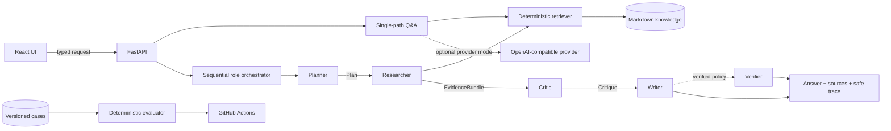

<div align="center">

# Agent-Me

**Build, inspect, and evaluate auditable multi-agent RAG systems.**

Agent-Me is an open-source reference implementation for auditable, role-based agent workflows, paired with a bilingual hands-on engineering curriculum.

[Quick start](#quick-start) · [Architecture](docs/ARCHITECTURE.md) · [API reference](docs/API.md) · [Curriculum](LEARN.md) · [Trust model](docs/TRUST.md)

<p>
  <a href="https://github.com/jzjzzzzzzz/agent-me/actions/workflows/ci.yml"></a>
  <a href="https://github.com/jzjzzzzzzz/agent-me/releases"></a>
  
  
  <a href="LICENSE"></a>
</p>

[English](README.md) · [简体中文](docs/i18n/README.zh-CN.md) · [All languages](docs/LOCALIZATION.md)

</div>


## Overview

Most agent demos expose only `prompt → model → answer`. Agent-Me exposes the work in between:

```text
request → planning → retrieval → evidence → critique → writing → verification → final answer
```

The system is deliberately small enough to read end to end and complete enough to run as a FastAPI + React application. Developers can inspect role boundaries, typed handoffs, retrieved evidence, blocking decisions, safe traces, and deterministic evaluation results instead of treating the final answer as a black box.

### Highlights

- **Auditable role workflow** — Planner, Researcher, Critic, Writer, and an optional Verifier communicate through explicit Python contracts.
- **Evidence-first RAG** — a bounded local retriever returns exact excerpts from reviewable, version-controlled Markdown.
- **Deterministic local path** — the core workflow and evaluation suite run without a paid model API.
- **Inspectable outputs** — every collaboration response includes sources, grounding status, a safe stage trace, and a run ID.
- **Reproducible stack** — FastAPI, React, Docker Compose, CI, tests, linting, type checks, and container smoke tests are included.
- **Bilingual learning path** — the maintained English and 简体中文 curriculum rebuilds the same architecture step by step.

## Quick start

### Docker Compose

**Requirement:** Docker with the Compose plugin.

```bash
git clone https://github.com/jzjzzzzzzz/agent-me.git
cd agent-me
cp .env.example .env
docker compose up --build
```

Open:

| Service | URL |
| --- | --- |
| Web application | <http://localhost:5173> |
| Interactive API docs | <http://localhost:8000/docs> |
| Health | <http://localhost:8000/health> |
| Readiness | <http://localhost:8000/ready> |

The default configuration uses local extractive and collaboration modes, so no API key is required. The web container reaches the API through a same-origin `/api` gateway.

<details>
<summary><strong>Run with the local toolchain</strong></summary>

**Requirements:** Python 3.11+, `uv` 0.11 or 0.12, Node.js 22+, npm, and Git.

```bash
git clone https://github.com/jzjzzzzzzz/agent-me.git
cd agent-me
make setup
make lint test docs evaluate
```

Start the services in separate terminals:

```bash
.venv/bin/uvicorn app.main:app --app-dir backend --reload
```

```bash
cd frontend && npm run dev
```

See [Lesson 00](course/00-course-setup/README.md) for platform-specific setup and troubleshooting.

</details>

## Architecture



The baseline policy executes Planner → Researcher → Critic → Writer. The verified policy adds Verifier as a fifth stage. Frozen dataclasses define the `Plan`, `EvidenceBundle`, `Critique`, `WrittenAnswer`, and `Verification` handoffs. Both policies run sequentially in one process against the same bounded retriever.

> [!NOTE]
> The Verifier checks citation paths and other implemented output invariants. It does not prove factual truth or semantic entailment. See [Trust, Data Flow, and Deployment Boundaries](docs/TRUST.md) for the complete system boundary.

Read [System Architecture](docs/ARCHITECTURE.md) for request paths and contracts, and [API Reference](docs/API.md) for endpoint schemas.

## Inspect a run

Run the five-stage verified workflow:

```bash
curl http://localhost:8000/api/v1/collaborate \
  -H 'Content-Type: application/json' \
  -d '{"question":"How does the example agent plan a project?","workflow":"verified"}'
```

A collaboration response makes the execution inspectable:

| Field | Meaning |
| --- | --- |
| `workflow` | Selected four- or five-stage policy |
| `sources` | Exact excerpts available to the roles |
| `grounded` | Whether the implemented evidence policy passed |
| `trace` | Role, outcome, safe summary, and metrics for each stage |
| `run_id` | Server-generated execution identity |

When evidence is missing, the Critic blocks synthesis and the Writer returns a fixed insufficient-evidence response. In verified mode, invalid citation paths or citation-count metadata are blocked as well.

## Evaluation

The checked-in fixtures cover supported, unsupported, adversarial, and boundary requests. Results are deterministic for the same code, corpus, workflow, and input.

```bash
make test
make evaluate
.venv/bin/python scripts/evaluate_collaboration.py --workflow verified --json
```

The default evaluator reports `COLLABORATION_EVAL 4/4 passed`. CI additionally runs backend tests, frontend lint/typecheck/tests/build, documentation validation, both workflow policies, and container smoke tests.

See [Lesson 06](course/06-evaluation/README.md) and the [versioned evaluation fixtures](course/fixtures/collaboration_cases.json).

## Engineering curriculum

The curriculum explains and rebuilds the architecture used by the reference implementation.

| # | Module | Focus |
| ---: | --- | --- |
| 00 | [Environment and learning loop](course/00-course-setup/README.md) | Reproducible local baseline |
| 01 | [Grounded Q&A foundations](course/01-grounded-qa/README.md) | Retrieval versus generation |
| 02 | [Build the retrieval pipeline](course/02-retrieval/README.md) | Chunking, ranking, and evidence |
| 03 | [Design collaborating roles](course/03-role-design/README.md) | Responsibility boundaries |
| 04 | [Typed handoffs and orchestration](course/04-typed-orchestration/README.md) | Contracts and invariants |
| 05 | [Critic gates and safe observability](course/05-critic-observability/README.md) | Blocking and trace safety |
| 06 | [Evaluation and failure injection](course/06-evaluation/README.md) | Repeatable behavioral evidence |
| 07 | [Production design and capstone](course/07-production-capstone/README.md) | Deployment boundaries and measured extension |

**Use the reference implementation** to run, inspect, and extend the system. **Use the curriculum** to rebuild it and understand why each component exists.

Start with the [English syllabus](course/README.md), [简体中文课程](course/translations/zh-CN/README.md), [learning path](LEARN.md), [rubric](course/RUBRIC.md), or [glossary](course/GLOSSARY.md).

## Extend Agent-Me

1. Replace [`knowledge/example-profile.md`](knowledge/example-profile.md) with reviewed Markdown you are allowed to use.
2. Configure `APP_NAME` and `APP_DESCRIPTION` in your private `.env`.
3. Add supported, unsupported, adversarial, and boundary evaluation cases.
4. Extend typed artifacts and update the Python and TypeScript contracts together.
5. Configure an OpenAI-compatible provider only when its data-processing boundary is acceptable.

Key implementation entry points:

```text
backend/app/collaboration.py        role contracts and orchestration
backend/app/knowledge.py            bounded deterministic retrieval
backend/app/main.py                 FastAPI routes and public metadata
frontend/src/                       React client and strict response parsing
course/fixtures/                    versioned behavioral cases
scripts/evaluate_collaboration.py   deterministic evaluator
```

## Security and trust

Local extractive and collaboration modes do not call an external model provider. Optional provider mode sends the question, recent history, and retrieved context to the configured OpenAI-compatible endpoint. The reference implementation does not persist chats or include application telemetry.

Read [Trust, Data Flow, and Deployment Boundaries](docs/TRUST.md) before adding private knowledge or an external provider. Report vulnerabilities through the private process in [SECURITY.md](SECURITY.md), not a public issue.

## Documentation

| Guide | Covers |
| --- | --- |
| [Architecture](docs/ARCHITECTURE.md) | Components, contracts, request paths, and limitations |
| [API reference](docs/API.md) | Endpoints, schemas, examples, and error behavior |
| [Trust model](docs/TRUST.md) | Local/provider data flow, persistence, verification, and deployment boundaries |
| [Deployment](docs/DEPLOYMENT.md) | Container behavior and production hardening gaps |
| [Localization](docs/LOCALIZATION.md) | UI locales, translated overviews, and contribution rules |
| [Course design](docs/COURSE_DESIGN.md) | Curriculum structure and learning outcomes |

## Contributing

Bug fixes, tests, evaluation cases, security improvements, accessibility work, curriculum updates, and reviewed translations are welcome. Read [CONTRIBUTING.md](CONTRIBUTING.md), follow the [Code of Conduct](CODE_OF_CONDUCT.md), and run the documented quality gates before opening a pull request.

## License

Agent-Me is available under the [MIT License](LICENSE).

## Acknowledgements

Special thanks to [BizBot](https://bizbot.zvo.cn/), developed by Weifang Leimingyun Network Technology Co., Ltd., for providing automated outreach and promotion support for Agent-Me.

Their support helps Agent-Me reach more developers, learners, and contributors interested in building auditable multi-agent systems.
