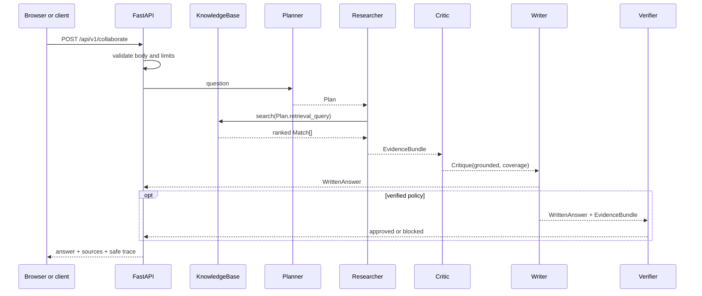

# Agent-Me Engineering Curriculum

[English](README.md) · [简体中文](translations/zh-CN/README.md) · [Language coverage](LANGUAGES.md) · [Repository home](../README.md)

The curriculum explains and rebuilds the same architecture used by the Agent-Me reference
implementation. You will run the FastAPI and React system, inspect its retrieval and collaboration
contracts, change the implementation, measure behavior, and defend the design in an interview or
review.

**Course promise:** every implemented claim is connected to source code, a runnable command, and an
observable result. The core path is deterministic and local, so you can learn without a paid model
API.

## Who this course is for

This course is a good fit if you:

- can read basic Python and HTTP examples;
- have built a small web or data application and want to learn agent architecture;
- want a portfolio project with tests, evaluation, frontend, backend, and deployment boundaries;
- need precise language for explaining “RAG,” “multi-agent,” “grounded,” and “observable.”

You do **not** need prior experience with FastAPI, React, RAG frameworks, vector databases, or
agent-orchestration libraries. Each lesson introduces the minimum theory before asking you to run
or change code.

## Outcomes

After completing all lessons and the required capstone, you should be able to:

1. map a question from HTTP input through validation, retrieval, role handoffs, and response output;
2. explain lexical retrieval, chunking, ranking, source evidence, and abstention tradeoffs;
3. compare a single execution path with a role-based collaboration path;
4. design typed artifacts with explicit ownership and invariants;
5. distinguish operational observability from private chain-of-thought;
6. create supported, unsupported, adversarial, and boundary evaluation cases;
7. evolve Python and TypeScript contracts without silently breaking clients;
8. describe what multi-worker execution adds: durable state, idempotency, retries, and backpressure;
9. show test and evaluation evidence instead of relying on a polished demo;
10. make a technically accurate portfolio claim based on work you actually completed.

## The system you will study



The current roles are local Python objects coordinated synchronously in one process. The baseline
ends at Writer; the verified policy appends Verifier. This keeps the learning surface small enough
to inspect. The capstone asks you to preserve these contracts while designing a more
production-shaped execution model.

## Curriculum

| # | Lesson | You will understand | You will produce | Time |
| ---: | --- | --- | --- | ---: |
| 00 | [Environment and learning loop](00-course-setup/README.md) | Reproducibility, quality gates, repository map | A passing baseline and lab notes | 30–45 min |
| 01 | [Grounded Q&A foundations](01-grounded-qa/README.md) | Grounding, retrieval vs. generation, abstention | Calls to both answer modes and an evidence map | 45–60 min |
| 02 | [Build the retrieval pipeline](02-retrieval/README.md) | Loading, chunking, tokenization, ranking | A retrieval regression test | 60–75 min |
| 03 | [Design collaborating roles](03-role-design/README.md) | Responsibility boundaries and orchestration costs | A single-vs-collaboration comparison | 45–60 min |
| 04 | [Typed handoffs and orchestration](04-typed-orchestration/README.md) | Artifacts, immutability, invariants, contract evolution | A tested handoff modification | 60–90 min |
| 05 | [Critic gates and safe observability](05-critic-observability/README.md) | Approval policy, abstention, trace safety | Approved and blocked UI evidence | 45–60 min |
| 06 | [Evaluation, tests, and failure injection](06-evaluation/README.md) | Evaluation design, precision/recall, CI layers | New cases and a detected deliberate failure | 60–90 min |
| 07 | [Production design and capstone](07-production-capstone/README.md) | Distributed reliability, security, tradeoffs | An ADR, extension, measurements, and demo | 90 min–3 days |

A complete [evidence-based sample capstone](examples/verified-policy-capstone/README.md) demonstrates how to connect an architecture decision, public fixtures, reproducible commands, measured results, limitations, and a defensible portfolio statement.

## Recommended learning loop

For each lesson:

```text
read the mental model
        ↓
inspect named source files
        ↓
run the baseline command
        ↓
change one controlled variable
        ↓
run focused verification
        ↓
record what the evidence proves
        ↓
answer the interview questions aloud
```

Create a branch for your work:

```bash
git switch -c learner/my-agent-lab
```

Keep a small `LEARNING_NOTES.md` in your fork. For each lesson, record:

- the command you ran;
- one observed response or test result;
- one assumption that failed;
- one design tradeoff;
- the commit containing your exercise.

This turns passive reading into inspectable engineering evidence.

## Two learning paths

### Path A — Guided beginner path

Complete 00 → 07 in order. Use the required exercise in every lesson. Budget 6–9 focused hours,
plus capstone time.

### Path B — Experienced engineer path

1. Run Lesson 00's baseline.
2. Read Lessons 02, 04, and 06 closely.
3. Complete the Lesson 07 architecture decision record and one advanced extension.
4. Return to Lessons 01, 03, and 05 for terminology and review questions.

Do not skip the deterministic baseline or evaluation exercise; those are what make later design
claims testable.

## Definition of completion

Reading every page is not sufficient. The course is complete when you can show:

- [ ] a clean install or container startup;
- [ ] passing lint, backend tests, frontend tests, documentation checks, and evaluation;
- [ ] one grounded and one unsupported request observed end to end;
- [ ] a diagram of every typed role handoff;
- [ ] at least one retrieval regression test you wrote;
- [ ] at least three evaluation cases you added;
- [ ] one deliberately introduced failure caught by an automated check;
- [ ] a capstone change with Python and TypeScript contract tests where applicable;
- [ ] an architecture decision record for a production concern;
- [ ] a short demo and resume statement whose wording matches the evidence.

Use the [assessment rubric](RUBRIC.md) to review your work.

## Precision of claims

The words used in this course have deliberately narrow meanings:

- **Agent:** a role with an input contract, responsibility, and output artifact.
- **Multi-agent:** several explicit roles coordinated through handoffs.
- **Grounded:** the workflow has retrieved local evidence under its current rule; this does not by
  itself prove every answer sentence is true.
- **Trace:** safe operational events, statuses, counts, and summaries—not private reasoning.
- **Deterministic:** the same code, corpus, and input produce the same decision in the local path.
- **Production-ready:** not claimed by the course baseline; Lesson 07 enumerates missing guarantees.

See the [glossary](GLOSSARY.md) for complete definitions.

## Help and contribution

If a step is ambiguous, that is a documentation bug. Search existing issues, then open a
[course feedback issue](https://github.com/jzjzzzzzzz/agent-me/issues/new?template=course.yml) with:

- lesson number and section;
- operating system and tool versions;
- exact command;
- sanitized output;
- expected and observed result.

Never include API keys, private documents, real user prompts, personal records, or `.env` contents.

Course fixes, new exercises, tests, accessibility improvements, and reviewed translations are
welcome. Read [CONTRIBUTING.md](../CONTRIBUTING.md) before opening a pull request.

## Course resources

- [Glossary](GLOSSARY.md)
- [Assessment and capstone rubric](RUBRIC.md)
- [Language coverage](LANGUAGES.md)
- [Reusable lesson template](LESSON_TEMPLATE.md)
- [Course design and references](../docs/COURSE_DESIGN.md)
- [System architecture](../docs/ARCHITECTURE.md)
- [API reference](../docs/API.md)
- [Security policy](../SECURITY.md)

## Begin

Continue to **[Lesson 00 — Environment and learning loop](00-course-setup/README.md)**.
