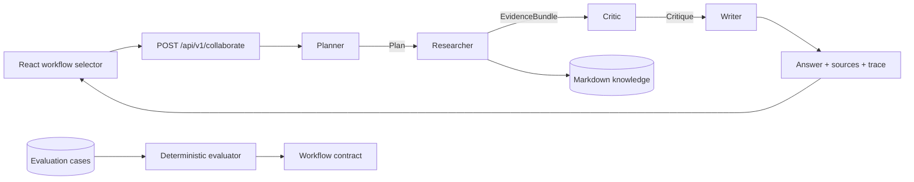

# Hands-on Multi-Agent Collaboration Course

[English](README.md) · [简体中文](README.zh-CN.md) · [Back to Agent-Me](../README.md)

This course turns Agent-Me into a portfolio project you can run, inspect, change, test, and explain
in an interview. You will work with a four-role collaboration pipeline:

```text
planner -> researcher -> critic -> writer
```

The course is implementation-first. Every lab has an observable artifact, a verification command,
and a completion criterion. No paid model API is required.

## What you will build

By the end, you will be able to demonstrate:

- role decomposition instead of one oversized prompt or function;
- typed handoffs between planner, researcher, critic, and writer;
- grounded retrieval from reviewable Markdown documents;
- a critic gate that blocks unsupported synthesis;
- an ordered operational trace that does not expose hidden chain-of-thought;
- deterministic evaluations for supported and unsupported questions;
- a typed FastAPI contract and a React trace viewer;
- CI, container smoke tests, input limits, and safe plain-text rendering.

## Be precise about the term “multi-agent”

This repository implements **role-based multi-agent orchestration in one application process**.
The roles have separate responsibilities and typed artifacts, and an orchestrator controls their
handoffs. The default lab is deterministic and local.

It does **not** claim that:

- four operating-system processes are running;
- four different language models are used;
- the roles are independently autonomous;
- the trace is private model chain-of-thought;
- the demo is a production distributed-agent platform.

That distinction makes the project easier to defend in an interview. You can accurately say that
you built and evaluated a role-based collaboration workflow, then explain what you would add for
parallel execution, durable queues, model routing, or distributed workers.

## Architecture



The internal handoff types live in
[`backend/app/collaboration.py`](../backend/app/collaboration.py). The public response types live in
[`backend/app/schemas.py`](../backend/app/schemas.py), and the browser validates the same contract
in [`frontend/src/api.ts`](../frontend/src/api.ts).

## Prerequisites

- Git;
- Python 3.11 or newer;
- Node.js 20 or newer and npm;
- Docker with the Compose plugin for the container lab.

Clone and install:

```bash
git clone https://github.com/jzjzzzzzzz/agent-me.git
cd agent-me
make setup
```

All commands below run from the repository root.

---

## Lab 0 — Establish a tested baseline

### Objective

Prove that your environment is reproducible before changing orchestration code.

### Run

```bash
make lint
make test
make docs
make evaluate
```

Expected evaluation summary:

```text
COLLABORATION_EVAL 3/3 passed
```

### Inspect

Open [`course/fixtures/collaboration_cases.json`](fixtures/collaboration_cases.json). It contains two
questions that should be grounded and one question that the critic should block.

### Completion criterion

- lint, tests, documentation links, and all three evaluation cases pass;
- you can explain why a deterministic baseline is useful before introducing model variability.

### Exercise

Add one supported question based on [`knowledge/example-profile.md`](../knowledge/example-profile.md)
and rerun `make evaluate`. Do not add a vague question that matches only a common word.

---

## Lab 1 — Compare single-agent and collaboration paths

### Objective

Understand what the orchestration path adds beyond the standard Q&A route.

### Start the API

```bash
.venv/bin/uvicorn app.main:app --app-dir backend --reload
```

In a second terminal, call the standard endpoint:

```bash
curl http://localhost:8000/api/v1/chat \
  -H 'Content-Type: application/json' \
  -d '{"question":"How does the example agent plan a project?"}'
```

Then call the collaboration endpoint:

```bash
curl http://localhost:8000/api/v1/collaborate \
  -H 'Content-Type: application/json' \
  -d '{"question":"How does the example agent plan a project?"}'
```

### Observe

Both routes return grounded sources. The collaboration route additionally returns:

- a server-generated `run_id`;
- the workflow identifier;
- a grounded decision;
- four ordered trace stages;
- safe metrics such as task, evidence, document, and citation counts.

The trace contains operational summaries and metrics, not hidden reasoning.

### Completion criterion

You can point to the additional contract fields and explain the cost/benefit: the collaboration
route is more observable and extensible, while the standard route is smaller and simpler.

---

## Lab 2 — Follow typed handoffs through the code

### Objective

Trace data ownership across role boundaries instead of treating “agents” as labels around one
shared mutable dictionary.

### Read in this order

1. `Plan`
2. `EvidenceBundle`
3. `Critique`
4. `WrittenAnswer`
5. `StageTrace`
6. `CollaborationResult`
7. `CollaborationOrchestrator.run`

All are in [`backend/app/collaboration.py`](../backend/app/collaboration.py).

### Handoff table

| Role | Receives | Produces | Responsibility |
| --- | --- | --- | --- |
| Planner | normalized question | `Plan` | define evidence-first tasks |
| Researcher | ranked retrieval matches | `EvidenceBundle` | collect local evidence |
| Critic | question + evidence | `Critique` | approve or block synthesis |
| Writer | evidence + critique | `WrittenAnswer` | cite evidence or return the safe fallback |

The dataclasses are frozen. A role cannot silently mutate a previous role’s artifact.

### Run focused tests

```bash
.venv/bin/pytest -q backend/tests/test_collaboration.py
```

### Exercise

Add a test that supplies two matches from two different document paths. Verify that:

- `document_count` is `2`;
- citations are unique and preserve ranked order;
- the writer never cites a path absent from the evidence bundle.

### Completion criterion

You can draw the handoff graph without looking at the source and identify which class owns each
decision.

---

## Lab 3 — Inspect the web trace viewer

### Objective

Use the workflow as an end user and verify that the browser does not trust arbitrary response
shapes.

### Start the complete stack

```bash
cp .env.example .env
docker compose up --build
```

Open <http://localhost:5173>, select **Multi-agent lab**, and submit:

```text
How does the example agent plan a project?
```

You should see:

- a grounded badge;
- a `run_...` identifier;
- planner, researcher, critic, and writer in order;
- per-stage operational metrics;
- source excerpts rendered as plain text.

Now submit:

```text
Explain quantum chromodynamics renormalization.
```

The critic stage should be blocked, the UI should show insufficient evidence, and the writer
should return the safe fallback with zero citations.

### Inspect the browser contract

[`frontend/src/api.ts`](../frontend/src/api.ts) rejects a collaboration response when:

- the run ID has the wrong format;
- the workflow or mode is unknown;
- stages are missing, duplicated, or out of order;
- an agent or outcome is unknown;
- metrics contain unsupported values.

### Completion criterion

You have observed both the approved and blocked paths in the browser and can explain why client
validation is still useful even when the server is typed.

---

## Lab 4 — Build an evaluation habit

### Objective

Replace “the demo looked good once” with repeatable behavioral checks.

### Run human-readable output

```bash
make evaluate
```

### Run machine-readable output

```bash
.venv/bin/python scripts/evaluate_collaboration.py --json
```

The evaluator checks expected grounded decisions, source counts, and the critic outcome. CI runs
the JSON form on every pull request.

### Add a failure deliberately

Temporarily change `expected_grounded` for `unsupported-domain` to `true`, then run:

```bash
make evaluate
echo $?
```

The evaluator should report a failure and exit with status `1`. Restore the fixture afterward.

### Design a better evaluation set

Create at least these categories:

1. direct fact present in one paragraph;
2. answer requiring evidence from two paragraphs;
3. paraphrase with few exact tokens;
4. unsupported domain question;
5. prompt-injection-like text that must still be treated as a question;
6. empty, malformed, and oversized API payloads.

Track precision separately from recall. The current token-overlap retriever is intentionally
small; a larger evaluation set will reveal its limitations.

### Completion criterion

Your branch has at least one new evaluation case, and you can explain why the expected outcome is
correct from the versioned knowledge file.

---

## Lab 5 — Add a verifier role

### Objective

Practice changing the workflow without collapsing typed boundaries.

Create a branch:

```bash
git switch -c lab/add-verifier
```

Implement a `VerifierAgent` between critic and writer. Its artifact should contain only facts that
can be checked mechanically, for example:

- every citation path exists in the evidence bundle;
- the answer is below a configured character limit;
- a blocked critique produces zero citations.

Update:

1. the internal role and artifact types;
2. the orchestrator and sequence numbers;
3. Pydantic response schemas;
4. the TypeScript parser;
5. backend and frontend tests;
6. evaluation output and this diagram.

Do not add an unrestricted `dict[str, Any]` handoff. The point of this lab is contract evolution.

### Completion criterion

The fifth role appears in the API and UI, malformed five-stage traces are rejected, and all quality
checks pass.

---

## Lab 6 — Production design review

### Objective

Separate what this local lab already guarantees from what a distributed system would require.

### Existing guarantees

- strict request schemas and body limits;
- server-controlled run IDs;
- deterministic role order;
- local, reviewable source evidence;
- safe plain-text rendering;
- no persistence of questions or traces;
- CI tests and a real container smoke request.

### Design exercise

Write an architecture decision record for a distributed version. Address:

- durable workflow state and idempotency;
- at-least-once delivery and duplicate stage execution;
- timeouts, retries, cancellation, and dead-letter handling;
- per-role model selection and budget limits;
- trace retention and privacy;
- authentication, authorization, and tenant isolation;
- evaluation drift and rollback;
- concurrency limits and backpressure.

Do not claim these are implemented until your code and tests prove them.

### Completion criterion

You can explain a migration path from the in-process orchestrator to workers and queues while
preserving the same typed artifacts and public API contract.

---

## Assessment rubric

| Area | Beginner | Portfolio ready | Strong interview evidence |
| --- | --- | --- | --- |
| Execution | starts the app | demonstrates approved and blocked paths | reproduces both from a clean clone |
| Contracts | names the roles | explains every typed handoff | evolves a handoff without breaking clients |
| Grounding | sees source cards | explains critic gating | adds precision/recall-oriented cases |
| Testing | runs unit tests | adds a regression test | injects failures and explains CI coverage |
| Operations | runs Docker | reads health/readiness and traces | proposes idempotent distributed execution |
| Communication | says “multi-agent” | states the exact local scope | compares tradeoffs with queues and model routing |

## Resume and portfolio guide

Use only claims you personally implemented and verified. A defensible bullet for the completed
base course is:

> Built a four-role multi-agent orchestration lab (planner → researcher → critic → writer) with
> typed handoffs, grounded Markdown retrieval, critic gating, inspectable execution traces,
> deterministic evaluations, a FastAPI/React interface, and containerized CI.

After adding your own evaluation cases, replace vague adjectives with measured results:

> Added **N** versioned evaluation cases covering supported and unsupported queries; enforced the
> suite in CI and achieved **X/N** expected grounded decisions on the documented fixture set.

Do not write “distributed multi-agent platform,” “autonomous agents,” or “multiple LLMs” unless you
actually add and test those properties.

### STAR interview outline

- **Situation:** A single Q&A path produced answers but offered little visibility into evidence
  review and synthesis decisions.
- **Task:** Make role boundaries, grounding decisions, and failure behavior inspectable without
  requiring a paid provider.
- **Action:** Implemented typed artifacts, a four-stage orchestrator, critic gating, a strict API and
  browser parser, deterministic fixtures, and container CI.
- **Result:** Demonstrate your measured test/evaluation results and show the approved and blocked
  traces live.

### Questions you should be ready to answer

1. Why are the role artifacts frozen and typed?
2. Why does the critic run before the writer?
3. What does `grounded` mean in this implementation?
4. Why is the trace not chain-of-thought?
5. Which failure modes remain if roles move to separate workers?
6. How would you make retries idempotent?
7. How would you measure retrieval precision and answer faithfulness?
8. When is a single-agent path better than this workflow?

## Troubleshooting

### `make evaluate` cannot import `app`

Run `make setup` first. The script also adds the repository’s `backend` directory to its local
module path, so it can be run directly with Python.

### Everything is marked unsupported

Check that `KNOWLEDGE_DIR` points to a directory containing UTF-8 Markdown and that `/ready` reports
at least one document.

### An unrelated question is marked grounded

The starter retriever uses token overlap. Add a regression case, inspect the matching excerpt, and
improve retrieval or filtering instead of hiding the example.

### The web page cannot reach the API

Confirm `VITE_API_BASE_URL`, `CORS_ORIGINS`, published ports, and `/health`. For the default Compose
configuration, the browser uses `http://localhost:8000`.

## Completion checklist

- [ ] Clean setup succeeds.
- [ ] Standard and collaboration API paths both run.
- [ ] Approved and blocked traces are observed in the browser.
- [ ] All typed handoffs can be explained.
- [ ] At least one evaluation case was added.
- [ ] A failure was injected and detected.
- [ ] Tests, docs, build, and container checks pass.
- [ ] Resume wording matches implemented behavior.
- [ ] A short architecture walkthrough is ready for an interview.
