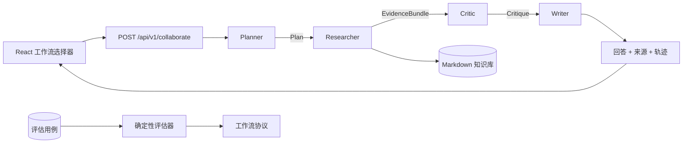

# Multi-Agent 协作实操课程

[English](README.md) · [简体中文](README.zh-CN.md) · [返回 Agent-Me](../README.md)

这套课程把 Agent-Me 变成一个可以运行、检查、修改、测试，并能在面试中讲清楚的作品集项目。
你将亲手操作以下四角色协作流水线：

```text
planner（规划） -> researcher（研究） -> critic（审查） -> writer（写作）
```

课程以实现为中心。每个实验都有可观察产物、验证命令和完成标准，而且不需要付费模型 API。

## 你最终会做出什么

完成后，你可以现场展示：

- 把一个大函数或大提示词拆成独立角色；
- planner、researcher、critic、writer 之间的类型化交接；
- 从可审查、可版本控制的 Markdown 文件中检索依据；
- 在没有依据时阻止不受支持内容生成的 critic 门禁；
- 不泄露隐藏思维链的有序操作轨迹；
- 对“有依据”和“无依据”问题执行确定性评估；
- 类型化 FastAPI 协议和 React 协作轨迹界面；
- CI、容器冒烟测试、输入限制和安全纯文本渲染。

## 准确理解“multi-agent”

本仓库实现的是：**单个应用进程内、基于角色的 multi-agent 编排**。每个角色有独立职责和
类型化产物，由 orchestrator（编排器）控制交接。默认实验完全在本地确定性运行。

它没有声称：

- 同时运行四个操作系统进程；
- 使用四个不同的大模型；
- 每个角色都能独立自主行动；
- 操作轨迹是模型的私有思维链；
- 当前示例已经是生产级分布式 Agent 平台。

明确这些边界反而更适合面试。你可以诚实地说自己实现并评估了角色协作工作流，再说明要实现
并行执行、持久队列、模型路由和分布式 worker 还需要增加什么。

## 架构



内部交接类型位于 [`backend/app/collaboration.py`](../backend/app/collaboration.py)，公开响应类型
位于 [`backend/app/schemas.py`](../backend/app/schemas.py)，浏览器会在
[`frontend/src/api.ts`](../frontend/src/api.ts) 中再次验证相同协议。

## 准备环境

- Git；
- Python 3.11 或更高版本；
- Node.js 20 或更高版本以及 npm；
- Docker 和 Compose 插件（用于容器实验）。

克隆并安装：

```bash
git clone https://github.com/jzjzzzzzzz/agent-me.git
cd agent-me
make setup
```

下面的命令都在仓库根目录运行。

---

## 实验 0：建立可复现基线

### 目标

修改编排代码前，先证明你的环境和结果可以复现。

### 运行

```bash
make lint
make test
make docs
make evaluate
```

预期评估摘要：

```text
COLLABORATION_EVAL 3/3 passed
```

### 检查

打开 [`course/fixtures/collaboration_cases.json`](fixtures/collaboration_cases.json)。其中有两个
应该找到依据的问题，以及一个应该被 critic 阻止的问题。

### 完成标准

- lint、测试、文档链接和三个评估用例全部通过；
- 你能解释为什么引入模型随机性之前要先建立确定性基线。

### 动手练习

根据 [`knowledge/example-profile.md`](../knowledge/example-profile.md) 新增一个有依据的问题并重新
运行 `make evaluate`。不要使用只会匹配常见词的模糊问题。

---

## 实验 1：比较单 Agent 和协作路径

### 目标

理解协作工作流在标准问答接口基础上增加了哪些能力。

### 启动 API

```bash
.venv/bin/uvicorn app.main:app --app-dir backend --reload
```

在第二个终端调用标准接口：

```bash
curl http://localhost:8000/api/v1/chat \
  -H 'Content-Type: application/json' \
  -d '{"question":"How does the example agent plan a project?"}'
```

再调用协作接口：

```bash
curl http://localhost:8000/api/v1/collaborate \
  -H 'Content-Type: application/json' \
  -d '{"question":"How does the example agent plan a project?"}'
```

### 观察

两个接口都会返回依据来源，但协作接口还会返回：

- 服务端生成的 `run_id`；
- 工作流标识；
- 是否有依据的判断；
- 四个有序轨迹阶段；
- 任务数、证据数、文档数和引用数等安全指标。

轨迹只包含操作摘要和指标，不包含隐藏推理过程。

### 完成标准

你能指出新增协议字段，并解释取舍：协作接口更容易观察和扩展，标准接口则更小、更简单。

---

## 实验 2：沿着类型化交接阅读代码

### 目标

理解每份数据属于哪个角色，而不是把“Agent”当作同一个可变字典外面的标签。

### 按顺序阅读

1. `Plan`
2. `EvidenceBundle`
3. `Critique`
4. `WrittenAnswer`
5. `StageTrace`
6. `CollaborationResult`
7. `CollaborationOrchestrator.run`

它们都位于 [`backend/app/collaboration.py`](../backend/app/collaboration.py)。

### 交接表

| 角色 | 接收 | 产出 | 职责 |
| --- | --- | --- | --- |
| Planner | 标准化问题 | `Plan` | 定义“依据优先”的任务 |
| Researcher | 排序后的检索结果 | `EvidenceBundle` | 收集本地依据 |
| Critic | 问题和依据 | `Critique` | 批准或阻止合成 |
| Writer | 依据和审查结果 | `WrittenAnswer` | 引用依据或返回安全兜底回答 |

这些 dataclass 都是 frozen 的，因此后一个角色不能偷偷修改前一个角色的产物。

### 运行聚焦测试

```bash
.venv/bin/pytest -q backend/tests/test_collaboration.py
```

### 动手练习

增加一个测试，传入来自两个不同文档路径的匹配片段，并验证：

- `document_count` 等于 `2`；
- 引用去重并保持检索排序；
- writer 不会引用证据包中不存在的路径。

### 完成标准

不看源码也能画出交接图，并指出每个决策由哪个类负责。

---

## 实验 3：使用网页协作轨迹

### 目标

像最终用户一样操作工作流，并验证浏览器不会盲目信任任意响应结构。

### 启动完整服务

```bash
cp .env.example .env
docker compose up --build
```

打开 <http://localhost:5173>，选择 **多 Agent 实验**，然后输入：

```text
How does the example agent plan a project?
```

页面应该显示：

- “已有依据”状态；
- `run_...` 运行标识；
- 顺序固定的 planner、researcher、critic、writer；
- 每个阶段的操作指标；
- 以纯文本安全显示的来源片段。

接着输入：

```text
Explain quantum chromodynamics renormalization.
```

critic 阶段应该显示 blocked，页面显示依据不足，writer 返回零引用的安全兜底回答。

### 检查浏览器协议

当出现以下情况时，[`frontend/src/api.ts`](../frontend/src/api.ts) 会拒绝协作响应：

- run ID 格式错误；
- 工作流或模式未知；
- 阶段缺失、重复或顺序错误；
- Agent 或 outcome 未知；
- metrics 中出现不支持的值。

### 完成标准

你已经在浏览器亲自观察 approved 和 blocked 两条路径，并能解释为什么服务端有类型后，客户端仍然
需要验证响应。

---

## 实验 4：建立评估习惯

### 目标

用可重复的行为检查替代“我刚才看着好像能用”。

### 人类可读输出

```bash
make evaluate
```

### 机器可读输出

```bash
.venv/bin/python scripts/evaluate_collaboration.py --json
```

评估器会检查预期 grounded 判断、来源数量和 critic outcome。CI 会在每个 Pull Request 上运行
JSON 形式的评估。

### 故意制造失败

临时把 `unsupported-domain` 的 `expected_grounded` 改为 `true`，然后运行：

```bash
make evaluate
echo $?
```

评估器应该报告失败并以状态码 `1` 退出。实验后恢复 fixture。

### 设计更好的评估集合

至少覆盖：

1. 单段落中直接存在的事实；
2. 需要两个段落依据的问题；
3. 与原文只有少量相同词的改写问题；
4. 知识库完全不支持的领域；
5. 类似提示词注入、但仍必须被当作普通问题处理的文本；
6. 空白、格式错误和超大 API 请求。

分别跟踪 precision 和 recall。当前 token-overlap 检索器有意保持简单，扩大评估集会暴露其边界。

### 完成标准

你的分支至少增加了一个评估用例，而且你能从版本化知识文件中解释预期结果为什么正确。

---

## 实验 5：增加 Verifier 角色

### 目标

练习在不破坏类型边界的情况下修改工作流。

创建分支：

```bash
git switch -c lab/add-verifier
```

在 critic 和 writer 之间实现 `VerifierAgent`。它的产物只能包含可以机械检查的事实，例如：

- 每个引用路径都存在于 evidence bundle；
- 回答没有超过配置的字符数；
- blocked critique 必须产生零引用。

你需要同步更新：

1. 内部角色和 artifact 类型；
2. orchestrator 和 sequence；
3. Pydantic 响应 schema；
4. TypeScript parser；
5. 后端与前端测试；
6. 评估输出和架构图。

不要使用无限制的 `dict[str, Any]` 交接。本实验的重点就是协议演进。

### 完成标准

第五个角色能出现在 API 和 UI 中，错误的五阶段轨迹会被拒绝，并且全部质量检查通过。

---

## 实验 6：生产架构评审

### 目标

区分本地实验已经保证的能力，以及分布式系统仍然需要的能力。

### 当前已经保证

- 严格请求 schema 和请求体限制；
- 服务端控制的 run ID；
- 确定性角色顺序；
- 本地、可审查的来源依据；
- 安全纯文本渲染；
- 不持久化问题或轨迹；
- CI 测试和真实容器协作接口冒烟请求。

### 设计练习

为分布式版本写一份架构决策记录，必须覆盖：

- 持久化工作流状态和幂等性；
- at-least-once delivery 与阶段重复执行；
- 超时、重试、取消和死信处理；
- 按角色选择模型和预算限制；
- 轨迹保留与隐私；
- 身份认证、权限和租户隔离；
- 评估漂移与回滚；
- 并发限制与背压。

代码和测试没有证明之前，不要在简历中声称这些已经实现。

### 完成标准

你能说明如何从单进程 orchestrator 迁移到 worker 与 queue，同时保留类型化 artifact 和公开 API
协议。

---

## 评分标准

| 领域 | 入门 | 可放入作品集 | 强面试证据 |
| --- | --- | --- | --- |
| 运行 | 能启动 | 能演示 approved/blocked | 能从全新 clone 复现 |
| 协议 | 记得角色名 | 能解释每次类型化交接 | 能演进协议且不破坏客户端 |
| Grounding | 看得到来源 | 能解释 critic 门禁 | 能增加 precision/recall 用例 |
| 测试 | 会运行测试 | 能增加回归测试 | 会注入失败并解释 CI 覆盖 |
| 运维 | 能运行 Docker | 会查看健康、就绪和轨迹 | 能设计幂等分布式执行 |
| 表达 | 只会说 multi-agent | 能准确说明本地范围 | 能比较 queue 和模型路由取舍 |

## 简历与作品集写法

只写你亲自完成并验证过的内容。完成基础课程后，可以使用这条可辩护的描述：

> 构建 planner → researcher → critic → writer 四角色 multi-agent 编排实验，实现类型化交接、
> Markdown 依据检索、critic 门禁、可检查执行轨迹、确定性评估、FastAPI/React 界面和容器化 CI。

增加自己的评估用例后，用实际数字替代模糊形容词：

> 新增 **N** 个版本化评估用例，覆盖支持与不支持问题；将评估接入 CI，并在已记录 fixture 上达到
> **X/N** 个预期 grounded 判断。

除非你真的增加并测试对应能力，否则不要写“分布式 multi-agent 平台”“自主 Agent”或“多个 LLM”。

### STAR 面试结构

- **Situation：** 单一问答路径可以返回答案，但无法清晰观察依据审查和内容合成决策。
- **Task：** 在不依赖付费模型的前提下，让角色边界、grounding 判断和失败行为可检查。
- **Action：** 实现类型化 artifacts、四阶段 orchestrator、critic 门禁、严格 API/浏览器解析器、
  确定性 fixtures 和容器 CI。
- **Result：** 展示你实际测得的测试与评估结果，并现场演示 approved 与 blocked 轨迹。

### 面试前应能回答

1. 为什么角色 artifacts 要 frozen 和 typed？
2. 为什么 critic 必须位于 writer 之前？
3. 当前实现中的 `grounded` 到底表示什么？
4. 为什么这条 trace 不是 chain-of-thought？
5. 把角色移到独立 worker 后会增加哪些失败模式？
6. 如何让重试具备幂等性？
7. 如何评估检索 precision 和回答 faithfulness？
8. 什么情况下单 Agent 路径反而更合适？

## 常见问题

### `make evaluate` 无法导入 `app`

先运行 `make setup`。评估脚本也会把仓库内 `backend` 目录加入自己的模块路径，所以可以直接用
Python 运行。

### 所有问题都显示不支持

检查 `KNOWLEDGE_DIR` 是否指向包含 UTF-8 Markdown 的目录，并确认 `/ready` 至少报告一份文档。

### 无关问题也被标记为 grounded

入门检索器使用 token overlap。增加回归用例并检查命中的片段，然后改进检索或过滤，不要隐藏问题。

### 网页无法访问 API

检查 `VITE_API_BASE_URL`、`CORS_ORIGINS`、端口以及 `/health`。默认 Compose 配置中，浏览器访问
`http://localhost:8000`。

## 完成清单

- [ ] 全新环境安装成功；
- [ ] 标准与协作 API 均可运行；
- [ ] 在网页观察 approved 与 blocked 轨迹；
- [ ] 能解释全部类型化交接；
- [ ] 至少新增一个评估用例；
- [ ] 主动制造过一次失败并被评估发现；
- [ ] 测试、文档、构建和容器检查通过；
- [ ] 简历措辞与实际能力一致；
- [ ] 已准备一段简短的架构讲解。
