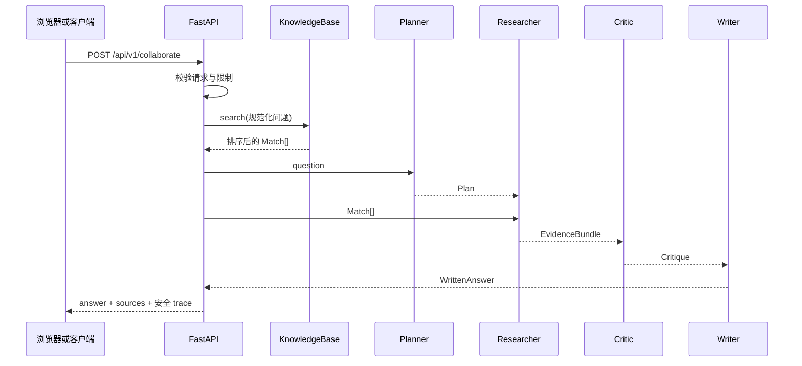

# Agent-Me 课程：从零构建有依据的 Multi-Agent 系统

[English](../../../course/README.md) · [简体中文](README.md) · [语言覆盖](../../../course/LANGUAGES.md) · [仓库首页](../../../README.md)

这是一套以实现为核心的免费课程。你会运行一个真实的 FastAPI + React 应用，阅读检索与协作协议，亲手修改代码，度量行为，并最终把项目准确地展示在简历、作品集或技术面试中。

**课程承诺：**每一个已实现的能力，都能对应到源代码、可运行命令和可观察结果。核心路径完全在本地确定性运行，不需要付费模型 API。

## 适合谁

如果你符合以下任意情况，这门课适合你：

- 能阅读基础 Python 与 HTTP 示例；
- 做过小型 Web/数据项目，想系统学习 Agent 架构；
- 希望作品同时包含后端、前端、测试、评估与部署边界；
- 想准确解释 RAG、multi-agent、grounded 与 observability，而不是只会调用框架。

你不需要预先掌握 FastAPI、React、向量数据库或 Agent 框架。每课都会先讲最小必要原理，再进入代码。

## 学完后你能做到

1. 从 HTTP 输入一路追踪到校验、检索、角色交接与输出；
2. 解释词法检索、分块、排序、证据与拒答的权衡；
3. 比较单路径与基于角色的协作路径；
4. 设计有明确所有权和不变量的类型化工件；
5. 区分安全的运行轨迹与私有 chain-of-thought；
6. 设计支持、无依据、对抗与边界评估用例；
7. 在不静默破坏客户端的情况下演进 Python/TypeScript 协议；
8. 解释多 Worker 系统需要的持久状态、幂等、重试与背压；
9. 用测试与评估证据替代“演示看起来不错”；
10. 根据自己真正完成的工作写出准确的项目描述。

## 你会研究的系统



当前角色是在同一进程中由 orchestrator 同步协调的 Python 对象。这样学习者可以检查每个边界。结课项目会要求你在保留这些协议的同时，设计更接近生产的执行方式。

## 课程目录

| # | 课程 | 理解内容 | 动手产物 | 时间 |
| ---: | --- | --- | --- | ---: |
| 00 | [环境与学习闭环](00-course-setup/README.md) | 可复现性、质量门、仓库结构 | 一套通过的基线与实验记录 | 30–45 分钟 |
| 01 | [有依据问答基础](01-grounded-qa/README.md) | Grounding、检索与生成、拒答 | 两种路径调用与证据流图 | 45–60 分钟 |
| 02 | [构建检索流水线](02-retrieval/README.md) | 加载、分块、分词、排序 | 检索回归测试 | 60–75 分钟 |
| 03 | [设计协作角色](03-role-design/README.md) | 职责边界与编排成本 | 单路径/协作路径对比 | 45–60 分钟 |
| 04 | [类型化交接与编排](04-typed-orchestration/README.md) | 工件、不变量、协议演进 | 一个经过测试的交接修改 | 60–90 分钟 |
| 05 | [Critic 门控与安全可观测性](05-critic-observability/README.md) | 审批策略、拒答、轨迹安全 | 通过/阻断两条 UI 证据 | 45–60 分钟 |
| 06 | [评估、测试与故障注入](06-evaluation/README.md) | 评估设计、准确率/召回率、CI | 新用例与被捕获的故障 | 60–90 分钟 |
| 07 | [生产设计与结课项目](07-production-capstone/README.md) | 分布式可靠性、安全与权衡 | ADR、扩展、度量和演示 | 90 分钟–3 天 |

## 推荐学习闭环

```text
理解概念
   ↓
按顺序阅读指定源码
   ↓
运行基线命令
   ↓
只改变一个变量
   ↓
运行聚焦验证
   ↓
记录证据能证明什么
   ↓
口头回答面试问题
```

建议在自己的 Fork 建立分支：

```bash
git switch -c learner/my-agent-lab
```

你可以在 Fork 中维护 `LEARNING_NOTES.md`，每课记录命令、观察结果、失败假设、设计权衡和对应 commit。不要写入密钥、私人文档或真实用户数据。

## 两条学习路线

### A：循序渐进

按 00 → 07 完成，每课至少做必做练习。基础课程约 6–9 小时，结课项目另计。

### B：有经验开发者

先完成第 00 课基线，重点阅读 02、04、06，再完成第 07 课 ADR 与一个高级扩展；最后回看 01、03、05 的术语和复盘题。

## 完成定义

只阅读不算完成。你应当能展示：

- [ ] 全新安装或容器启动；
- [ ] Lint、后端/前端测试、文档检查和评估全部通过；
- [ ] 一条有依据请求和一条无依据请求；
- [ ] 每个角色交接的图；
- [ ] 至少一个自己写的检索回归测试；
- [ ] 至少三个新增评估用例；
- [ ] 一次被自动化检查捕获的故障；
- [ ] 一个包含必要协议测试的结课改动；
- [ ] 一份生产问题 ADR；
- [ ] 与实际证据一致的演示和简历表述。

使用[评分标准](RUBRIC.md)自评。

## 准确使用术语

- **Agent：**有输入协议、职责和输出工件的角色。
- **Multi-agent：**多个显式角色通过交接被统一协调。
- **Grounded：**当前规则找到了本地证据；不代表每句话必然真实。
- **Trace：**安全的步骤、状态、计数和摘要，不是私有推理过程。
- **Deterministic：**相同代码、语料与输入在本地路径得到同样决定。
- **Production-ready：**基线不作此声明；第 07 课会列出仍缺失的保证。

更多定义见[中英文词汇表](GLOSSARY.md)。

## 获取帮助与参与贡献

如果步骤不清楚，它就是文档问题。请搜索已有 Issue，然后使用
[课程反馈模板](https://github.com/jzjzzzzzzz/agent-me/issues/new?template=course.yml)，提供课号、系统与工具版本、准确命令、脱敏输出、预期与实际结果。

课程修订、新练习、测试、无障碍优化和经过人工复核的翻译都欢迎。提交前阅读
[`CONTRIBUTING.md`](../../../CONTRIBUTING.md)。安全问题按 [`SECURITY.md`](../../../SECURITY.md) 私下报告。

## 课程资源

- [词汇表](GLOSSARY.md)
- [评分标准](RUBRIC.md)
- [英文课程](../../../course/README.md)
- [系统架构](../../../docs/ARCHITECTURE.md)
- [API 参考](../../../docs/API.md)
- [课程设计](../../../docs/COURSE_DESIGN.md)

## 开始学习

继续阅读 **[第 00 课：环境与证据优先学习闭环](00-course-setup/README.md)**。
