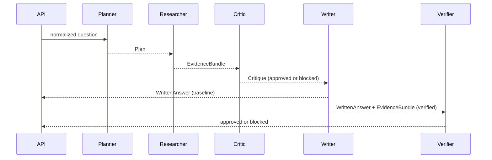

# Architecture

## Trust boundaries

1. Browser questions are untrusted and validated by Pydantic.
2. Knowledge files are operator-controlled but bounded by the configured root and file-size limit; symbolic links are rejected and content is rendered as plain text.
3. Provider output is untrusted and rendered as text, never inserted as HTML. Before submission,
   the browser uses the public `external_provider_enabled` flag to disclose whether the question,
   recent history, and retrieved context will be forwarded to the configured provider.
4. Secrets are loaded from environment variables and excluded from source control.

## Request path

`POST /api/v1/chat` validates the body, enforces the configured question limit, removes a small
set of English stop words from the query, scores Markdown paragraphs by meaningful-token coverage,
and returns up to four sources that meet the default `0.75` threshold. If all provider settings are
present, the service calls the provider's `/chat/completions` route using a grounded system message.
Otherwise it returns the highest-ranked excerpt.

Tokenization applies Unicode NFKC normalization followed by case folding. Unicode letters and
numbers remain word tokens, while Han characters remain individual tokens to preserve the
starter's deterministic CJK behavior. Retrieval scoring and collaboration coverage metrics share
this implementation so canonically equivalent text is treated consistently.

The API reuses `KnowledgeBase` instances for identical roots and size limits. Every access still
rescans bounded file metadata and re-enforces the root, symlink, file-type, and size rules; unchanged
signatures reuse immutable parsed documents, while add/edit/remove operations invalidate the cache.
Readiness, search, and the local collaboration run execute through Starlette's worker thread pool so
synchronous filesystem work does not block the async event loop. The cache is process-local only;
the filesystem remains authoritative after edits and process restarts.

## Multi-agent learning path

`POST /api/v1/collaborate` injects the same bounded Markdown retriever used by the single-path API
into the collaboration workflow. The default policy runs four local roles in a fixed order; the
optional verified policy adds a final output-contract gate:

The planner stores the normalized retrieval query in an immutable `Plan`. The researcher receives
that exact plan and owns the retriever call that turns it into an `EvidenceBundle`; retrieval is not
precomputed at the HTTP boundary. The remaining role artifacts are also frozen dataclasses. The
orchestrator owns ordering and produces a server-controlled run ID plus four or five operational
trace stages. A trace stage contains a role identifier, outcome, safe summary, and numeric/boolean
metrics. It is an audit-friendly workflow record, not model chain-of-thought.

The critic approves synthesis only when retrieval produced evidence. Without evidence it emits a blocked outcome and the writer returns a fixed insufficient-evidence response with zero citations. The default collaboration workflow never calls the optional external provider.

`workflow="verified"` keeps the baseline contract available while appending `VerifierAgent`. This
role checks mechanical invariants after writing: expected evidence paths must appear as citations,
and the reported citation count must equal the unique evidence-path count. A failed check replaces
the candidate with a server-controlled fallback instead of leaking an unverified answer. It does
not perform entailment, contradiction detection, or formal truth verification; those require a
labeled evaluation set and a stronger policy.

This is intentionally an in-process, sequential teaching implementation. Moving stages to distributed workers would require durable state, idempotency, delivery semantics, timeouts, retries, cancellation, authorization, and trace-retention controls. See the [hands-on course](../course/README.md) for the implementation and design exercises.

The starter does not persist requests. Add a database only when the product needs persistence, and document the purpose, retention, and access controls before collecting data.
