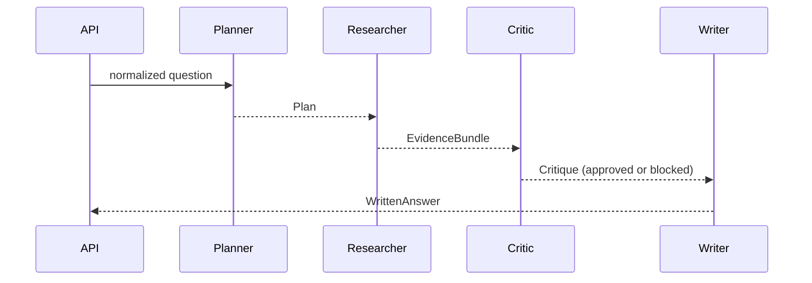

# Architecture

## Trust boundaries

1. Browser questions are untrusted and validated by Pydantic.
2. Knowledge files are operator-controlled but bounded by the configured root and file-size limit; symbolic links are rejected and content is rendered as plain text.
3. Provider output is untrusted and rendered as text, never inserted as HTML.
4. Secrets are loaded from environment variables and excluded from source control.

## Request path

`POST /api/v1/chat` validates the body, enforces the configured question limit, tokenizes the question, scores Markdown paragraphs by token overlap, and returns up to four sources. If all provider settings are present, the service calls the provider's `/chat/completions` route using a grounded system message. Otherwise it returns the highest-ranked excerpt.

## Multi-agent learning path

`POST /api/v1/collaborate` injects the same bounded Markdown retriever used by the single-path API
into the collaboration workflow and runs four local roles in a fixed order:

The planner stores the normalized retrieval query in an immutable `Plan`. The researcher receives
that exact plan and owns the retriever call that turns it into an `EvidenceBundle`; retrieval is not
precomputed at the HTTP boundary. The remaining role artifacts are also frozen dataclasses. The
orchestrator owns ordering and produces a server-controlled run ID plus four operational trace
stages. A trace stage contains a role identifier, outcome, safe summary, and numeric/boolean
metrics. It is an audit-friendly workflow record, not model chain-of-thought.

The critic approves synthesis only when retrieval produced evidence. Without evidence it emits a blocked outcome and the writer returns a fixed insufficient-evidence response with zero citations. The default collaboration workflow never calls the optional external provider.

This is intentionally an in-process, sequential teaching implementation. Moving stages to distributed workers would require durable state, idempotency, delivery semantics, timeouts, retries, cancellation, authorization, and trace-retention controls. See the [hands-on course](../course/README.md) for the implementation and design exercises.

The starter does not persist requests. Add a database only when the product needs persistence, and document the purpose, retention, and access controls before collecting data.
