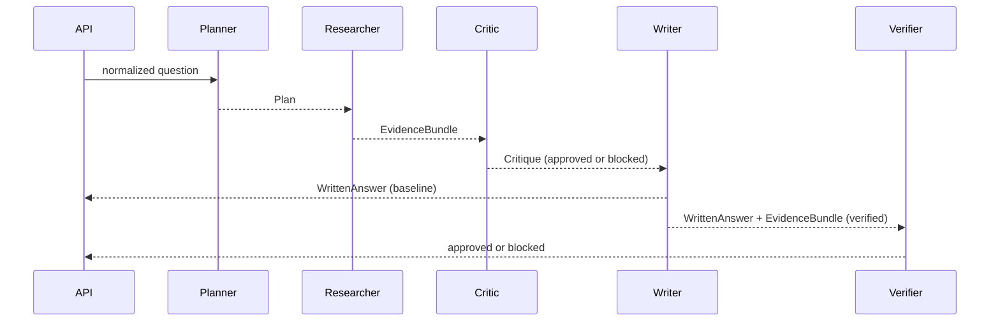

# Architecture

Agent-Me is an inspectable reference implementation of an in-process, role-based multi-agent RAG
workflow. It favors explicit contracts and deterministic behavior over general-purpose framework
abstractions. See [Trust, Data Flow, and Deployment Boundaries](TRUST.md) for the complete scope.

## Trust boundaries

1. Browser questions are untrusted and validated by Pydantic.
2. Knowledge files are operator-controlled but bounded by the configured root, per-file size,
   document count, and aggregate corpus size; symbolic links are rejected and content is rendered as
   plain text.
3. Provider output is untrusted and rendered as text, never inserted as HTML. Before submission,
   the browser uses the public `external_provider_enabled` flag to disclose whether the question,
   recent history, and retrieved context will be forwarded to the configured provider.
4. Secrets are loaded from environment variables and excluded from source control.

## Observability

An outer ASGI middleware (`RequestIDMiddleware`) attaches a fresh, server-generated `X-Request-ID`
header to every HTTP response, including those produced by application exception handlers. It never
reads or reflects a client-supplied `X-Request-ID`, and the value carries no user input, prompt
content, or knowledge-base data — see [`docs/API.md`](API.md#request-correlation).

## Request path

`POST /api/v1/chat` validates the body, enforces the configured question limit, removes a small
set of English stop words from the query, scores Markdown paragraphs by meaningful-token coverage,
and returns up to four sources that meet the default `0.75` threshold. If all provider settings are
present, the service calls the provider's `/chat/completions` route using a grounded system message.
Otherwise it returns the highest-ranked excerpt.

Tokenization applies Unicode NFKC normalization followed by case folding. Unicode letters and
numbers remain word tokens, while Han characters remain individual tokens to preserve the
reference implementation's deterministic CJK behavior. Retrieval scoring and collaboration coverage metrics share
this implementation so canonically equivalent text is treated consistently.

The API reuses `KnowledgeBase` instances only for identical roots and identical per-file,
document-count, and aggregate-byte limits. Every access still rescans bounded file metadata and
re-enforces the root, symlink, file-type, and size rules; unchanged signatures reuse immutable parsed
documents, while add/edit/remove operations invalidate the cache.
Readiness, search, and the local collaboration run execute through Starlette's worker thread pool so
synchronous filesystem work does not block the async event loop. The cache is process-local only;
the filesystem remains authoritative after edits and process restarts.

## Role-based multi-agent workflow

`POST /api/v1/collaborate` injects the same bounded Markdown retriever used by the single-path API
into the collaboration workflow. The default policy runs four local roles in a fixed order; the
optional verified policy adds a final output-contract gate:

```mermaid
sequenceDiagram
  participant API
  participant P as Planner
  participant R as Researcher
  participant C as Critic
  participant W as Writer
  participant V as Verifier
  API->>P: normalized question
  P-->>R: Plan
  R-->>C: EvidenceBundle
  C-->>W: Critique (approved or blocked)
  W-->>API: WrittenAnswer (baseline)
  W-->>V: WrittenAnswer + EvidenceBundle (verified)
  V-->>API: approved or blocked
```

The planner stores the normalized retrieval query in an immutable `Plan`. The researcher receives
that exact plan and owns the retriever call that turns it into an `EvidenceBundle`; retrieval is not
precomputed at the HTTP boundary. The remaining role artifacts are also frozen dataclasses. The
orchestrator owns ordering and produces a server-controlled run ID plus four or five operational
trace stages. A trace stage contains a role identifier, outcome, safe summary, and numeric/boolean
metrics. It is an audit-friendly workflow record, not model chain-of-thought.

The critic approves synthesis only when retrieval produced evidence. Without evidence it emits a blocked outcome and the writer returns a fixed insufficient-evidence response with zero citations. The default collaboration workflow never calls the optional external provider.

`workflow="verified"` keeps the baseline contract available while appending `VerifierAgent`. This
role checks mechanical invariants after writing: expected evidence paths must appear as citations,
and the reported citation count must equal the unique evidence-path count. A failed check replaces
the candidate with a server-controlled fallback instead of leaking an unverified answer. It does
not perform entailment, contradiction detection, or formal truth verification; those require a
labeled evaluation set and a stronger policy.

This is intentionally an in-process, sequential reference implementation. Moving stages to
distributed workers would require durable state, idempotency, delivery semantics, timeouts,
retries, cancellation, authorization, and trace-retention controls. The
[engineering curriculum](../course/README.md) rebuilds these contracts and examines those tradeoffs.

The public reference endpoints do not persist requests. The opt-in, token-protected
[private workspace](PERSONAL.md) persists its own chats and confirmed memories in SQLite;
public endpoints never read that database. Add a database only when the product needs
persistence, and document the purpose, retention, and access controls before collecting data.

## Independent personal-memory core

`backend/app/memory.py` provides the local single-owner memory repository and typed records without
FastAPI, provider, or configuration imports. It maintains pending, confirmed, and superseded states,
transactional revision snapshots, optional optimistic review preconditions, and source-linked
restore candidates. Only current confirmed records participate in context assembly.
`backend/app/personal.py` adapts these operations to authenticated routes; `backend/app/main.py`
translates domain errors into HTTP responses. Public Q&A and collaboration do not use this store.

`scripts/evaluate_memory.py` exercises longitudinal changes with disposable synthetic data and no
provider calls. See [memory contracts](PERSONAL.md#typed-memory-contract--结构化记忆契约) for migration,
export, and deletion semantics. This is not yet entity resolution, semantic memory extraction,
or automatic ingestion of ordinary conversation.

## Controlled learning and local owner CLI

`memory_models.py` owns immutable memory/source input contracts and typed persistence/export
records. `learning.py` proposes literal fields or paragraph excerpts only from approved sources.
Candidate writes and provenance are atomic; normalized digests deduplicate exact claims and
prevent automatic resurrection after forgetting. Durable runs contain bounded stage outcomes,
hashes, and record IDs, not original documents or private reasoning. Failure recovery reuses a run ID.

`agent_cli.py` provides owner operations without loading configuration, HTTP modules, or providers.
Private API routes are adapters to the same core. Structured sensitive records are withheld from
context by default; owner opt-in is explicit. This does not classify private Markdown automatically.
See [learning contracts](LEARNING.md) and the [acceptance ledger](AGENT_IMPLEMENTATION.md).

## Identity and temporal repository semantics

`identity.py` manages owner-reviewed typed identities, canonical aliases and current relationships linked
to exact memory revisions. `memory_time.py` separates UTC validity/occurrence from learned time.
`memory.py` selects epistemic state and applies current/historical privacy floors without resurrecting
deleted snapshots. `retention.py` performs policy-based forgetting only through previewed, stale-safe,
explicit atomic plans. All have native Core/API/CLI paths with no frontend addition.
See [identity/time contracts](IDENTITY_TIME.md) and `scripts/evaluate_identity.py`.
